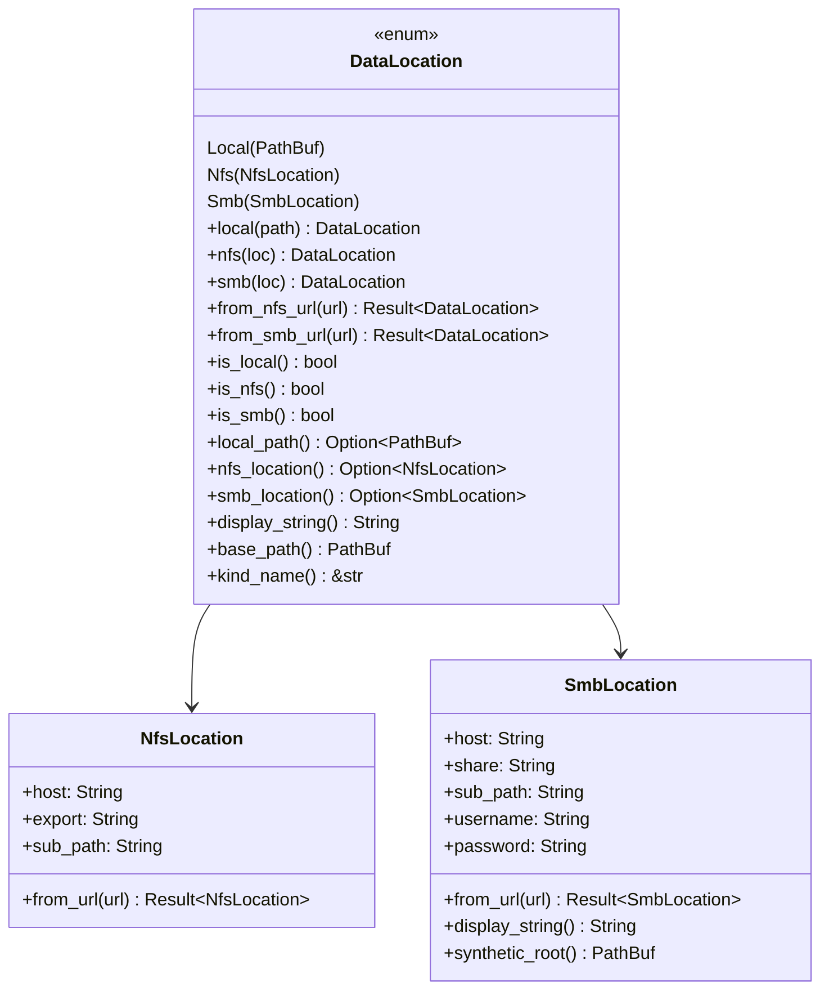
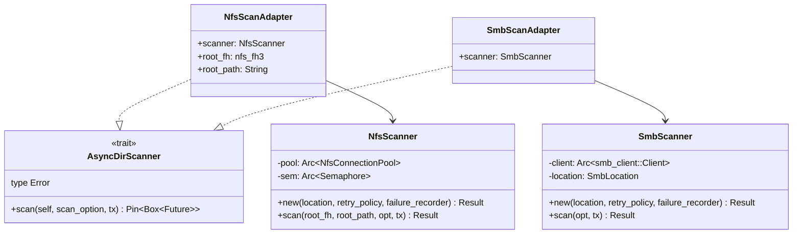
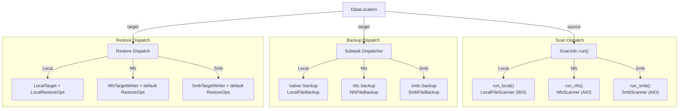

# Transport Layer

The transport layer is the foundation of fpt-rs's pluggable architecture. It defines a set of traits that abstract over filesystem operations, allowing the scanner and backup engines to work identically across local, NFS, and SMB transports.

## DataLocation

`DataLocation` is the enum that describes **where user data lives**. It is used for both source and target sides of a backup or restore job.

```rust
pub enum DataLocation {
    Local(PathBuf),
    #[cfg(feature = "nfs")]
    Nfs(NfsLocation),
    #[cfg(feature = "smb")]
    Smb(SmbLocation),
}
```



`DataLocation` serves as the **dispatch key** throughout the frame layer. Every major operation (scan, backup, restore) matches on `DataLocation` to select the correct transport implementation:

```rust
pub fn run(&self) -> Result<ScanStats, ScanError> {
    match self.source {
        DataLocation::Local(_) => self.run_local(),
        DataLocation::Nfs(_) => self.run_nfs(),
        DataLocation::Smb(_) => self.run_smb(),
    }
}
```

## Core Traits

### AsyncDirScanner

Defined in `src/scanner/engine/aio.rs`, this trait abstracts over protocol-specific async directory scanners. Both NFS and SMB scanners implement it via adapter structs.

```rust
pub trait AsyncDirScanner: Send + 'static {
    type Error: std::fmt::Display + Send + 'static;

    fn scan(
        self,
        scan_option: Arc<ScanOption>,
        tx: tokio::sync::mpsc::Sender<DirBatchScanResult>,
    ) -> Pin<Box<dyn Future<Output = Result<(), Self::Error>> + Send>>;
}
```



The `run_aio_scan()` function provides the shared scaffolding for all async scanners:
1. Creates the `BlockingQueue` and `ScanStatistics`.
2. Starts metadata writer threads.
3. Spawns the scanner task.
4. Bridges results from `tokio::mpsc` to `BlockingQueue`.
5. Waits for completion, closes the queue, joins writers.
6. Generates control files.

### SourceReader

Defined in `src/backup/aio/transport.rs`, this trait reads data from a source filesystem.

```rust
pub trait SourceReader: Clone + Send + Sync + 'static {
    fn read_block(
        &self,
        block: CopyBlock,
    ) -> BoxFuture<'static, Result<CopyBlock, (CopyBlock, String)>>;

    fn finish(&self) -> BoxFuture<'static, Result<(), String>> {
        Box::pin(async { Ok(()) })
    }
}
```

The `read_block()` method takes a `CopyBlock` and returns it with the `data` field populated and `src_offset` advanced. The `is_last` flag indicates when the entire file has been read.

### TargetWriter

Also defined in `src/backup/aio/transport.rs`, this trait writes data to a target filesystem.

```rust
pub trait TargetWriter: Clone + Send + Sync + 'static {
    fn create_dir(&self, path: PathBuf) -> BoxFuture<'static, Result<(), String>>;

    fn write_block(
        &self,
        block: CopyBlock,
    ) -> BoxFuture<'static, Result<CopyBlock, (CopyBlock, String)>>;

    fn write_file(
        &self,
        fcb: FileControlBlock,
    ) -> BoxFuture<'static, Result<FileControlBlock, (FileControlBlock, String)>> { ... }

    fn finish(&self) -> BoxFuture<'static, Result<(), String>> {
        Box::pin(async { Ok(()) })
    }
}
```

`write_block()` writes the `data` portion of a `CopyBlock` to the target at `dst_offset`, then returns the block with `dst_offset` advanced. The default `write_file()` converts a `FileControlBlock` to a `CopyBlock` and delegates to `write_block()`.

### PostCopyPhases

Defined in `src/backup/aio/phases_trait.rs`, this trait runs post-copy phases (hardlink, delete, mtime) on the target.

```rust
pub trait PostCopyPhases: Send + Sync {
    async fn run_hardlink_phase(&self, ctrl_dir, source_dir_base, target_prefix,
                                 phase_flags, retry_policy, failure_recorder) { /* no-op */ }
    async fn run_delete_phase(&self, ctrl_dir, source_dir_base, target_prefix,
                               phase_flags, retry_policy, failure_recorder) { /* no-op */ }
    async fn run_mtime_phase(&self, ctrl_dir, source_dir_base, target_prefix,
                              phase_flags, retry_policy, failure_recorder) { /* no-op */ }
    async fn run_all_phases(&self, ...) {
        self.run_hardlink_phase(...).await;
        self.run_delete_phase(...).await;
        self.run_mtime_phase(...).await;
    }
}
```

All methods have default no-op implementations. Each transport overrides only the phases it supports.

### RestoreOps

Defined in `src/backup/aio/restore_ops.rs`, this trait provides restore-specific operations.

```rust
pub trait RestoreOps: Send + Sync {
    fn create_symlink(&self, _link_path: &Path, _target: &str) -> Result<(), String> {
        Ok(())
    }
    fn restore_metadata(&self, _path: &Path, _meta: &MetaCommon) {}
}
```

Only the local transport implements meaningful `create_symlink()` and `restore_metadata()` -- remote transports use the defaults (no-op).

## Trait Implementation Map

```mermaid
classDiagram
    class SourceReader {
        <<trait>>
        +read_block(CopyBlock) Result~CopyBlock~
        +finish() Result
    }

    class TargetWriter {
        <<trait>>
        +create_dir(PathBuf) Result
        +write_block(CopyBlock) Result~CopyBlock~
        +write_file(FCB) Result~FCB~
        +finish() Result
    }

    class PostCopyPhases {
        <<trait>>
        +run_hardlink_phase()
        +run_delete_phase()
        +run_mtime_phase()
        +run_all_phases()
    }

    class RestoreOps {
        <<trait>>
        +create_symlink(path, target) Result
        +restore_metadata(path, meta)
    }

    class LocalSource {
        +buffer_size: usize
    }
    class LocalTarget {
        +base: PathBuf
    }
    class LocalPhases {
        +run_hardlink_phase()
        +run_delete_phase()
        +run_mtime_phase()
    }
    class LocalRestoreOps {
        +create_symlink()
        +restore_metadata()
    }

    class NfsSourceReader {
        -pool: NfsConnectionPool
        -root_fh: nfs_fh3
    }
    class NfsTargetWriter {
        -pool: NfsConnectionPool
        -root_fh: nfs_fh3
        -dir_cache: DirHandleCache
    }
    class NfsPhases {
        -pool: NfsConnectionPool
        -root_fh: nfs_fh3
    }

    class SmbTargetWriter {
        -client: smb_client::Client
        -location: SmbLocation
    }
    class SmbPhases {
        -client: smb_client::Client
        -location: SmbLocation
    }

    LocalSource ..|> SourceReader
    NfsSourceReader ..|> SourceReader
    LocalTarget ..|> TargetWriter
    NfsTargetWriter ..|> TargetWriter
    SmbTargetWriter ..|> TargetWriter
    LocalPhases ..|> PostCopyPhases
    NfsPhases ..|> PostCopyPhases
    SmbPhases ..|> PostCopyPhases
    LocalRestoreOps ..|> RestoreOps
```



## Transport-Specific Details

### Native (Local Filesystem)

The native transport uses direct POSIX/Win32 syscalls. It does not need a connection pool.

- **Scanner**: `LocalFileScanner` uses the BIO engine (blocking OS threads). Does not implement `AsyncDirScanner` -- it has its own `scan()` method that returns `ScanStats` directly.
- **SourceReader**: `LocalSource` reads file chunks via `task::spawn_blocking()` wrapping `read_local_file_chunk()`.
- **TargetWriter**: `LocalTarget` writes file chunks via `task::spawn_blocking()` wrapping `write_local_file_chunk()`.
- **PostCopyPhases**: `LocalPhases` reads hardlink/delete/mtime control files and applies them directly via `std::fs`.
- **RestoreOps**: `LocalRestoreOps` creates symlinks via `std::os::unix::fs::symlink()` and restores permissions/xattrs/ACLs.

### NFS (NFSv3)

The NFS transport communicates directly with an NFS server via RPC, requiring no kernel mount.

- **Connection**: `NfsConnectionPool` manages a pool of NFS RPC connections. Connections are acquired/released per operation.
- **Scanner**: `NfsScanner` implements async directory listing via NFS `READDIRPLUS3` RPCs. Wrapped by `NfsScanAdapter` to implement `AsyncDirScanner`.
- **SourceReader**: `NfsSourceReader` reads file data via NFS `READ3` RPCs, returning `CopyBlock` units.
- **TargetWriter**: `NfsTargetWriter` writes file data via NFS `WRITE3` RPCs. Uses a `DirHandleCache` to avoid repeated directory lookups. `create_dir()` walks path components, creating missing directories via `MKDIR3`.
- **PostCopyPhases**: `NfsPhases` implements hardlink (`LINK3`), delete (`REMOVE3`/`RMDIR3`), and mtime (`SETATTR3`) via NFS RPCs.

### SMB (SMB2/3)

The SMB transport uses an async SMB client for Windows shares and Samba servers.

- **Connection**: SMB connection pool manages authenticated sessions to the SMB server.
- **Scanner**: `SmbScanner` implements async directory listing via SMB `QUERY_DIRECTORY` operations. Wrapped by `SmbScanAdapter` to implement `AsyncDirScanner`. Includes detailed metrics tracking (`SmbScanMetrics`).
- **TargetWriter**: `SmbTargetWriter` writes file data via SMB `WRITE` operations. `create_dir()` uses SMB `CREATE` + `CLOSE` for directory creation.
- **PostCopyPhases**: `SmbPhases` implements hardlink, delete, and mtime via SMB operations.
- **Note**: SMB currently does not have a `SourceReader` implementation -- for SMB-to-SMB or SMB-as-source backups, data is read from the local D_REPO staging area.

## How Transports Are Selected

The frame layer selects the transport at multiple points:



## CopyBlock: The Transfer Unit

`CopyBlock` is the common data unit that flows between `SourceReader` and `TargetWriter`:

```rust
pub struct CopyBlock {
    pub meta: Arc<FileMeta>,
    pub src_path: PathBuf,
    pub dst_path: PathBuf,
    pub src_offset: u64,
    pub dst_offset: u64,
    pub file_size: u64,
    pub data: Vec<u8>,
    pub is_last: bool,
}
```

The block is designed for **chunked transfer** of large files:

1. A `FileControlBlock` is converted to a `CopyBlock` via `CopyBlock::from_fcb()`.
2. The `SourceReader::read_block()` fills `data` and advances `src_offset`.
3. The `TargetWriter::write_block()` writes `data` and advances `dst_offset`.
4. The loop continues until `read_complete() && write_complete()`.
5. `data` is cleared between iterations to bound memory usage.

```mermaid
stateDiagram-v2
    [*] --> Init: CopyBlock::from_fcb(fcb)
    Init --> Reading: src_offset < file_size
    Reading --> ReadDone: src.read_block() fills data<br/>src_offset advanced
    ReadDone --> Writing: target.write_block(data)
    Writing --> WriteDone: dst_offset advanced<br/>data cleared
    WriteDone --> Reading: src_offset < file_size
    WriteDone --> Complete: read_complete() && write_complete()
    Complete --> [*]
```
