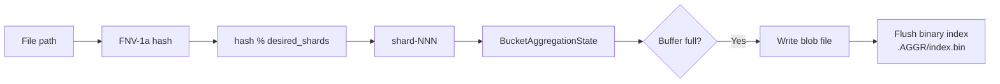

# Aggregation

Many filesystems contain millions of small files (configuration files, source code, log fragments). Storing each as a separate file in the backup repository creates enormous metadata overhead and poor I/O patterns. **Aggregation** solves this by packing small files into large **blob** files, with an index that maps original paths to `(blob, offset, size)` triples.

## When Aggregation Happens

Aggregation is controlled by `AggregateConfig`:

| Parameter | Default | Description |
|---|---|---|
| `enabled` | false | Master switch |
| `file_threshold` | 1 MB | Files smaller than this are aggregated |
| `max_blob_size` | 64 MB | Maximum size of a single blob file |
| `shard_count` | 8 | Number of shard partitions (Shard layout only) |

A file is aggregated when: `enabled == true && file_size > 0 && file_size < file_threshold`. Symlinks are never aggregated.

## Two Layouts

fpt-rs supports two aggregation layouts, each with different index structures and directory placement strategies.

### DIR_LEVEL Layout

In DIR_LEVEL layout, aggregation is **per-directory**. Each directory that contains aggregated files gets its own `.AGGR_DIR/` subdirectory with blob files and a SQLite index.

```
backup_root/
  docs/
    .AGGR_DIR/
      index.db          <-- SQLite index for docs/
      <snowflake>.blob  <-- blob files for docs/
    readme.md
    large-file.bin
  src/
    .AGGR_DIR/
      index.db
      <snowflake>.blob
    main.rs
```

The SQLite index maps `relative_path -> (blob_path, offset, size)` for fast lookup during restore.

```mermaid
flowchart TD
    A[Small file: docs/config.toml] --> B{size < threshold?}
    B -->|Yes| C[Buffer in BucketAggregationState<br/>key = parent_dir = "docs"]
    C --> D{Buffer >= max_blob_size?}
    D -->|Yes| E[Flush: write blob to<br/>docs/.AGGR_DIR/snowflake.blob]
    D -->|No| F[Keep buffering]
    E --> G[Record AggregateFileEntry<br/>in blob metadata]
    G --> H[On finish: write SQLite index<br/>docs/.AGGR_DIR/index.db]
```

### SHARD Layout

In SHARD layout, all aggregated files are stored in a **shared** `.AGGR/` directory at the repository root, partitioned into numbered shards. The index is a single binary file.

```
backup_root/
  .AGGR/
    index.bin           <-- Binary index for all aggregated files
    shard-000/
      <snowflake>.blob
    shard-001/
      <snowflake>.blob
    ...
    shard-007/
      <snowflake>.blob
```

Files are assigned to shards by hashing their relative path (FNV-1a):



The `desired_shards` value grows dynamically based on `bytes_seen / max_blob_size`, capped at `shard_count`. This ensures that early in a backup (when little data has been seen), fewer shards are used, reducing blob file fragmentation.

## Blob Files

A blob file is a simple concatenation of file contents:

```
+------------------+
| file_1 data      |  offset 0, size S1
+------------------+
| file_2 data      |  offset S1, size S2
+------------------+
| file_3 data      |  offset S1+S2, size S3
+------------------+
```

Each blob's metadata (`AggregateBlobMeta`) records the path, size, file count, and a list of `AggregateFileEntry` records with per-file offsets, sizes, timestamps, mode, xattrs, and ACLs.

## Index Formats

### SQLite Index (DIR_LEVEL)

Each `.AGGR_DIR/index.db` contains a single table mapping file names to blob locations. The restore pipeline queries this index per-directory.

### Binary Index (SHARD)

The `.AGGR/index.bin` file is a compact binary index (`AggregateIndex`) that maps relative file paths to `(blob_path, offset, size)` triples. It supports `query_file(path)` for O(1) lookup during restore.

## Integration with the Backup Pipeline

The `AggregatingTarget<T>` wraps any `TargetWriter` and intercepts `write_block` calls:

1. If the block should be aggregated (small, complete, not a symlink), it is buffered in a per-bucket state
2. When a bucket reaches `max_blob_size`, the accumulated files are flushed as a blob
3. On `finish()`, all remaining buffers are flushed and the index files are written
4. Large files and symlinks pass through to the inner `TargetWriter` unchanged

During restore, `LocalRepoRestoreSource` queries the appropriate index (SQLite for DIR_LEVEL, binary for SHARD) to locate each file's data within its blob.

## Configuration Example

```rust
let config = AggregateConfig::enabled()
    .layout(AggregateLayout::Shard)
    .file_threshold(1024 * 1024)     // 1 MB
    .max_blob_size(64 * 1024 * 1024) // 64 MB
    .shard_count(16);
```
