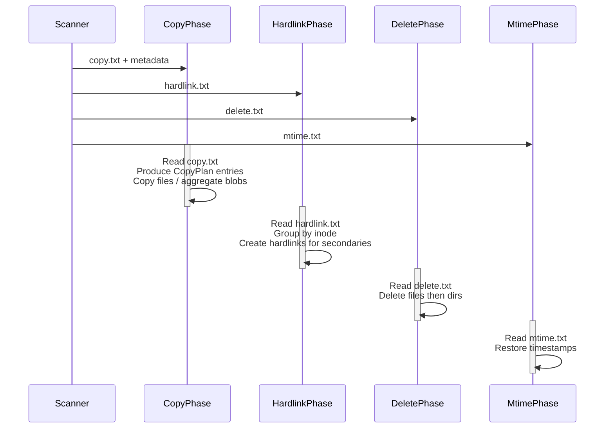
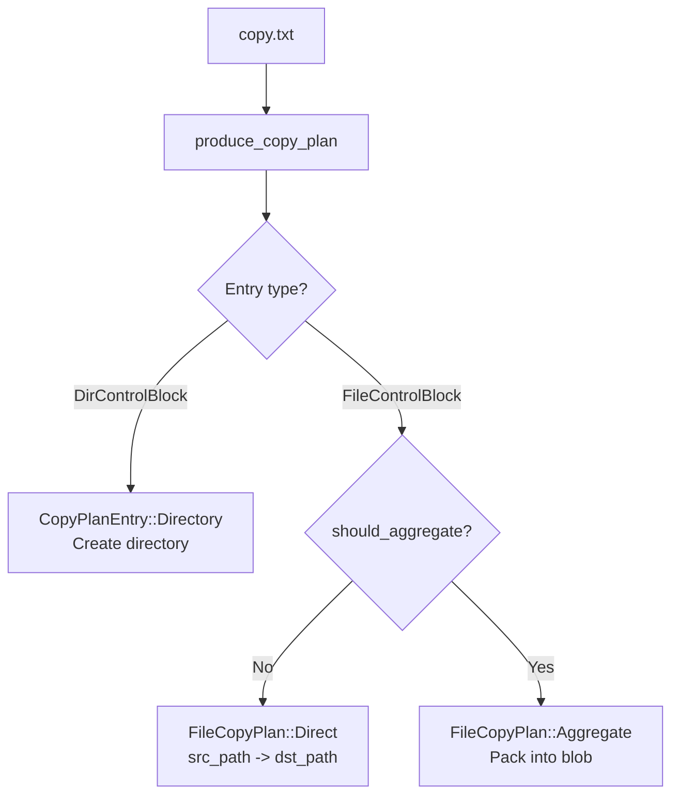

# Backup Pipeline

After the scanner produces control files and metadata, the **backup pipeline** transfers data from the source to the destination repository. The pipeline has four sequential phases: **copy**, **hardlink**, **delete**, and **mtime**. Each phase reads its own control file and operates independently.

## Phase Overview

## Phase 1: Copy

The copy phase is the heaviest. It reads `copy.txt`, loads the corresponding `FileMeta` / `DirMeta` from the metadata repository, and produces `CopyPlanEntry` items.

### CopyPlan Entries

- **CopyPlanEntry::Directory** -- Creates the target directory, records its `DirMeta`
- **FileCopyPlan::Direct** -- Copies the file from `src_path` to `dst_path` chunk by chunk
- **FileCopyPlan::Aggregate** -- Buffers the file data for packing into an aggregate blob

### CopyBlock -- The Transfer Unit

Large files are transferred in `CopyBlock` units, each containing:

| Field | Description |
|---|---|
| `meta` | `Arc<FileMeta>` for the file |
| `src_path` / `dst_path` | Source and destination paths |
| `src_offset` / `dst_offset` | Byte offsets for resumable chunked I/O |
| `file_size` | Total logical file size |
| `data` | Bounded payload buffer |
| `is_last` | Whether this block completes the file |

The block-based design enables backpressure: the pipeline can limit outstanding blocks by count or total bytes.

### Aggregation

If aggregation is enabled, files smaller than `file_threshold` (default 1 MB) are not written individually. Instead, they are buffered in an `AggregatingTarget<T>` wrapper that packs multiple small files into blob files up to `max_blob_size` (default 64 MB). See [Aggregation](./aggregation.md) for details.

## Phase 2: Hardlink

The hardlink phase reads `hardlink.txt`, which contains interleaved `Inode` and `File` records. For each inode group:

1. The **first file** in the group was already copied during phase 1 (the "primary").
2. All **subsequent files** in the group are created as hardlinks pointing to the primary.

This preserves the original filesystem's hardlink structure on the destination.

See [Hardlinks](./hardlinks.md) for the full mechanism.

## Phase 3: Delete

The delete phase reads `delete.txt` and removes files and directories that no longer exist in the source. Entries are typed as either `Dir` or `File`. Files are deleted first, then directories, to avoid removing non-empty directories.

## Phase 4: Mtime

The mtime phase reads `mtime.txt` and restores directory timestamps (`atime`, `mtime`) and ownership (`uid`, `gid`, `mode`). This must run last because earlier phases may modify directory timestamps during file creation.

Each `MtimeDirEntry` contains:

| Field | Description |
|---|---|
| `path` | Directory path |
| `mode` | Permission bits |
| `uid` / `gid` | Owner and group |
| `atime` / `mtime` | Access and modification times (seconds since epoch) |

## Configuration

The backup pipeline is configured via `BackupConfig`:

| Option | Default | Description |
|---|---|---|
| `enable_hardlink` | false | Run the hardlink phase |
| `enable_delete` | false | Run the delete phase |
| `enable_mtime` | false | Run the mtime phase |
| `aggregate_config` | Disabled | Aggregation settings |
| `copy_buffer_size` | 1 MB | Per-file copy buffer (256 KB -- 4 MB) |
| `retry_policy` | 3 retries, 1s | Exponential backoff with jitter |

## Transport Abstraction

The copy phase uses two core traits:

- **`SourceReader`** -- Reads `CopyBlock` data from the source (local filesystem, aggregate blob, or remote)
- **`TargetWriter`** -- Writes `CopyBlock` data to the destination (local filesystem, NFS, SMB, or aggregating wrapper)

Post-copy phases use the **`PostCopyPhases`** trait with default no-op implementations. Each transport (local, NFS, SMB) overrides only the phases it supports.

