# Control Files

Control files are the communication channel between the scanner and the backup/restore pipeline. They describe **what to copy**, **what to hardlink**, **what to delete**, and **what timestamps to restore**. All control files share a common binary format: a fixed 4 KB ASCII header followed by a sequence of length-prefixed binary records.

## Common Structure

Every control file begins with a 4 KB header block written as human-readable ASCII key-value pairs, padded with spaces to exactly 4096 bytes. Immediately after the header, records begin at byte offset 4096.

```mermaid
block-beta
    columns 1
    block:header["Header Block (4096 bytes)"]
        A["#FPT_COPY_CTRL_FILE  (magic identifier)"]
        B["version=3"]
        C["header_size=4096"]
        D["file_count=1234"]
        E["dir_count=56"]
        F["inode_count=0"]
        G["record_count=1290"]
        H["time=1718000000"]
        I["source_kind=local"]
        J["source_root=/data"]
        K["... padded to 4096 bytes with spaces"]
    end
    block:records["Record Stream"]
        L["[Record 1] len_u32 | payload"]
        M["[Record 2] len_u32 | payload"]
        N["[Record 3] len_u32 | payload"]
        O["..."]
    end
```



### Header Fields

| Field | Type | Description |
|---|---|---|
| Magic line | ASCII | File type identifier (first line) |
| `version` | u32 | Format version (currently `3`) |
| `header_size` | u32 | Always `4096` |
| `file_count` | u64 | Number of file records |
| `dir_count` | u64 | Number of directory records |
| `inode_count` | u64 | Number of inode group records |
| `record_count` | u64 | Total record count |
| `time` | u64 | Creation time (seconds since Unix epoch) |
| `source_kind` | String | `"local"`, `"nfs"`, or `"smb"` |
| `source_root` | String | Root path of the scan source |

The header is written at file creation (with zero counts) and **rewritten** at finalization (`finish()`) with the final counts. This two-pass approach allows streaming record writes without knowing the total count upfront.

### Record Format

Each record is:

```
+--------+------------------+
| u32 LE | payload (N bytes)|   length = N
+--------+------------------+
```

The 4-byte little-endian length prefix includes only the payload size, not the prefix itself.

## Control File Types

### copy.txt -- File and Directory Control

Magic: `#FPT_COPY_CTRL_FILE`

Contains two interleaved record types: directory entries and file entries. Each entry references a metadata record via `(meta_fid, meta_offset)`.

**File Record** (`FileControlEntry`):

| Field | Size | Description |
|---|---|---|
| Tag | 1 byte | `0x02` (file record) |
| `diff` | 1 byte | `1`=New, `2`=DataModified, `3`=MetaModified, `4`=Deleted |
| `meta_fid` | 4 bytes | Metadata file ID (u32 LE) |
| `meta_offset` | 4 bytes | Byte offset in metadata file (u32 LE) |
| `name_len` | 4 bytes | Length of name string (u32 LE) |
| `name` | N bytes | UTF-8 file name |

**Directory Record** (`DirControlEntry`):

| Field | Size | Description |
|---|---|---|
| Tag | 1 byte | `0x01` (directory record) |
| `meta_fid` | 4 bytes | Metadata file ID (u32 LE) |
| `meta_offset` | 4 bytes | Byte offset in metadata file (u32 LE) |
| `name_len` | 4 bytes | Length of path string (u32 LE) |
| `name` | N bytes | UTF-8 directory path |

### hardlink.txt -- Hardlink Groups

Magic: `#FPT_HARDLINK_CTRL_FILE`

Contains interleaved `Inode` and `File` records. See [Hardlinks](./hardlinks.md) for the full record layout.

**Inode Record**:

| Field | Size | Description |
|---|---|---|
| Tag | 1 byte | `0x01` |
| `inode` | 8 bytes | Inode number (u64 LE) |
| `device` | 8 bytes | Device number (u64 LE) |
| `link_count` | 4 bytes | Hard link count (u32 LE) |

**File Record**:

| Field | Size | Description |
|---|---|---|
| Tag | 1 byte | `0x02` |
| `meta_fid` | 4 bytes | Metadata file ID (u32 LE) |
| `meta_offset` | 4 bytes | Byte offset in metadata file (u32 LE) |
| `path_len` | 4 bytes | Length of path (u32 LE) |
| `path` | N bytes | UTF-8 file path |

### delete.txt -- Deletion Entries

Magic: `#FPT_DELETE_CTRL_FILE`

Contains entries for files and directories that should be removed from the target.

**Delete Record** (`DeleteEntry`):

| Field | Size | Description |
|---|---|---|
| `entry_type` | 1 byte | `1`=Dir, `2`=File |
| Reserved | 3 bytes | Padding (zero) |
| `path_len` | 4 bytes | Length of path (u32 LE) |
| `path` | N bytes | UTF-8 path |

### mtime.txt -- Timestamp Restoration

Magic: `#FPT_MTIME_CTRL_FILE`

Contains directory metadata for restoring timestamps after the copy and hardlink phases.

**Mtime Record** (`MtimeDirEntry`):

| Field | Size | Description |
|---|---|---|
| `mode` | 4 bytes | Permission bits (u32 LE) |
| `uid` | 4 bytes | Owner user ID (u32 LE) |
| `gid` | 4 bytes | Owner group ID (u32 LE) |
| `path_len` | 4 bytes | Length of path (u32 LE) |
| `atime` | 8 bytes | Access time, seconds since epoch (u64 LE) |
| `mtime` | 8 bytes | Modification time, seconds since epoch (u64 LE) |
| `path` | N bytes | UTF-8 directory path |

## Sharding

When the scanner uses multiple writer threads, control files can be **sharded** -- each writer thread produces its own control file with a shard suffix (e.g., `copy.txt.0`, `copy.txt.1`, ...). The backup engine reads all shards during the copy phase, or a single **primary** control file is selected via `find_primary_control_file()`. Sharding allows parallel writes without contention.

## Implementation

The control file codec is implemented in `control_codec.rs` with shared helpers:

- `create_record_writer()` -- Creates file, writes header, seeks to byte 4096
- `write_record()` -- Writes a length-prefixed record
- `finish_record_writer()` -- Seeks to byte 0, rewrites header with final counts
- `open_record_reader()` -- Opens file, validates magic, seeks to byte 4096
- `read_record()` -- Reads one length-prefixed record
- `put_u8/u16/u32/u64()` and `take_u8/u16/u32/u64()` -- Little-endian field helpers
