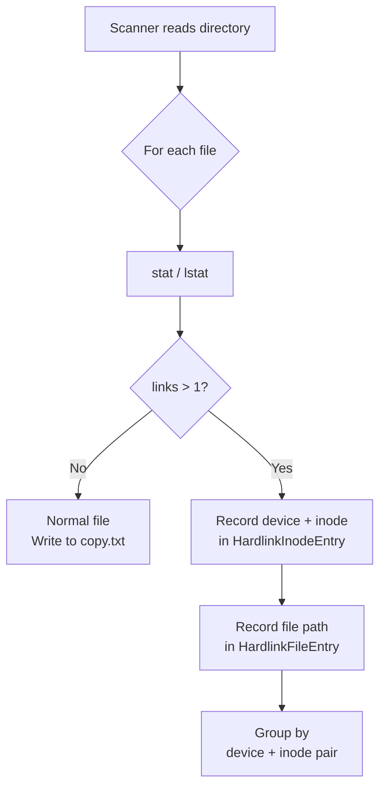
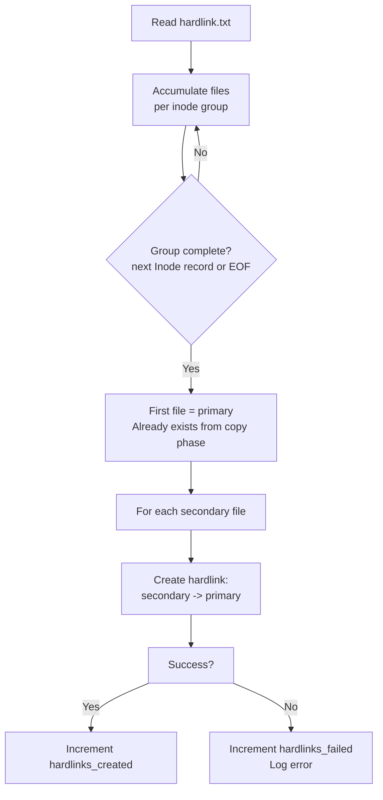

# Hardlinks

A hardlink is a directory entry that shares the same inode (and therefore the same data) as another file. On a typical Linux filesystem, many files may share an inode -- for example, package managers, build systems, and deduplication tools create hardlinks extensively. fpt-rs detects hardlinks during the scan phase and preserves them during backup so the destination has the same structure.

## Detection During Scan

The scanner detects hardlinks by examining each file's link count (`nlink` on Unix, `GetFileInformationByHandle` on Windows). Files with `nlink > 1` are potential hardlink candidates.

During scanning, the scanner maintains an in-memory map of `(device, inode) -> Vec<path>`. When a file with `nlink > 1` is encountered:

1. A `HardlinkInodeEntry` is written with the inode number, device number, and link count
2. A `HardlinkFileEntry` is written for each path that shares that inode

The control file interleaves these as `Inode` then `File` records, forming groups.

## Control File Format

The `hardlink.txt` binary file contains:

```mermaid
block-beta
    columns 1
    block:header["4 KB Header"]
        A["#FPT_HARDLINK_CTRL_FILE magic"]
        B["version, record_count, file_count, inode_count"]
        C["time, source_kind, source_root"]
        D["... padded to 4096 bytes"]
    end
    block:records["Binary Records"]
        E["[Inode record] inode=12345 dev=2065 nlink=3"]
        F["[File record] path=/data/a.txt meta_fid=0 meta_offset=42"]
        G["[File record] path=/data/b.txt meta_fid=0 meta_offset=99"]
        H["[File record] path=/data/c.txt meta_fid=1 meta_offset=10"]
        I["[Inode record] inode=67890 dev=2065 nlink=2"]
        J["[File record] path=/data/d.txt meta_fid=1 meta_offset=55"]
        K["[File record] path=/data/e.txt meta_fid=2 meta_offset=0"]
    end
```

Each record is length-prefixed (4-byte little-endian length, then payload). The payload starts with a 1-byte record type tag (`1` = Inode, `2` = File).

### Inode Record Payload (21 bytes)

| Offset | Size | Field |
|---|---|---|
| 0 | 1 | Type tag (`0x01`) |
| 1 | 8 | Inode number (u64 LE) |
| 9 | 8 | Device number (u64 LE) |
| 17 | 4 | Link count (u32 LE) |

### File Record Payload (variable)

| Offset | Size | Field |
|---|---|---|
| 0 | 1 | Type tag (`0x02`) |
| 1 | 4 | `meta_fid` -- metadata file ID (u32 LE) |
| 5 | 4 | `meta_offset` -- byte offset in metadata file (u32 LE) |
| 9 | 4 | Path length in bytes (u32 LE) |
| 13 | N | Path (UTF-8) |

## Backup Phase -- Creating Hardlinks

During the hardlink phase of backup, the engine reads `hardlink.txt` and processes each inode group:

The key rule: **only the first file in each group is copied** during the copy phase. All subsequent files are created as hardlinks pointing to the first file's destination path. This means:

- The first file must exist before the hardlink phase runs (guaranteed by copy running first)
- Hardlinks preserve the original filesystem's link structure
- Only one copy of the data is stored, even when N paths reference it

## Transport-Specific Implementation

Each backup transport implements hardlinking differently:

| Transport | Mechanism |
|---|---|
| Local | `std::fs::hard_link(primary, secondary)` |
| NFS v3 | `LINK3` RPC -- `link(file_fh, parent_dir_fh, filename)` |
| SMB | `FSCTL_SET_SPARSE` or SMB2 `SET_INFO` with `FileLinkInformation` |

All transports share the same control file reader (`HardlinkControlFileReader`) and group-processing logic.

## Restore Considerations

During restore, hardlinks are handled implicitly: since the backup stores only one copy of the data (in the primary file's location), restoring the primary file restores the data. The hardlink phase then creates the link structure on the target. If the restore target is a local filesystem, `std::fs::hard_link` is used; for remote targets, the appropriate transport RPC is called.
