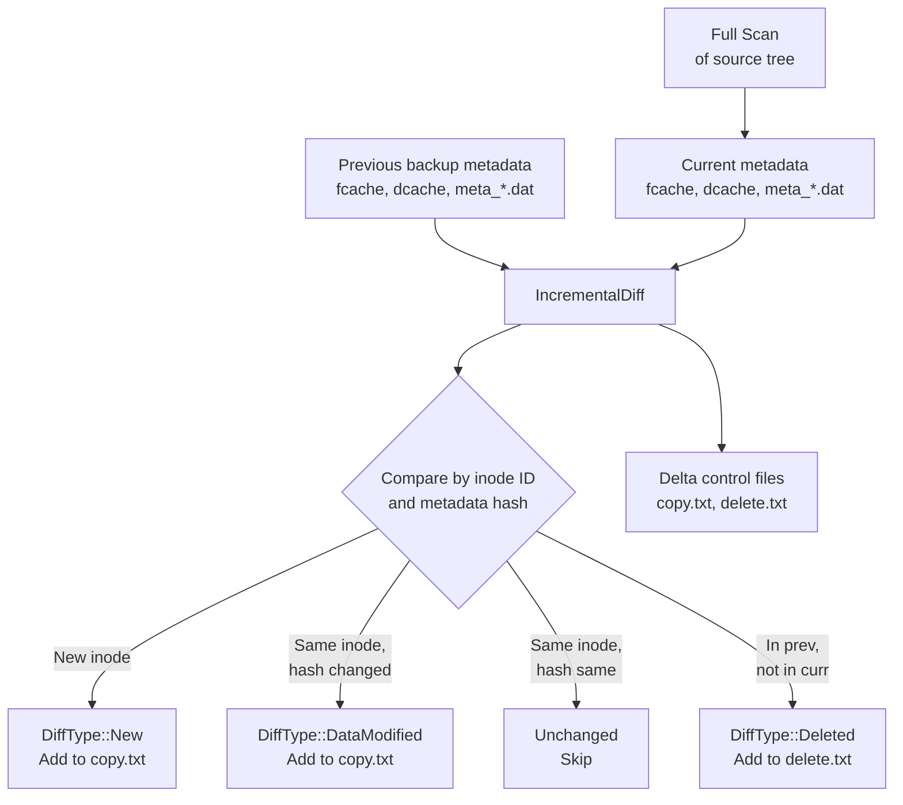
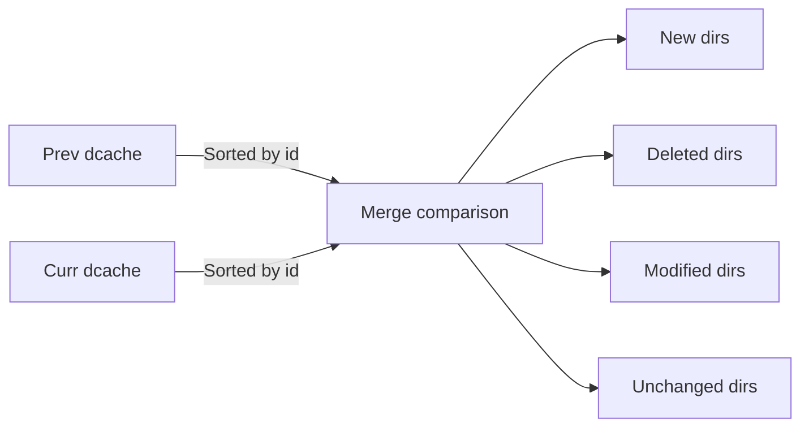
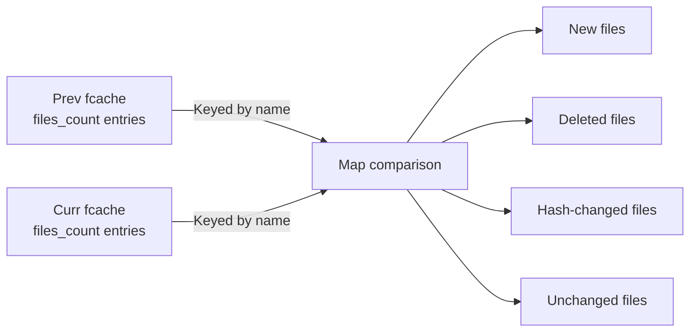

# Incremental Backup

Incremental backup avoids re-copying unchanged files by comparing the current filesystem state against the metadata from a previous backup. The scanner always performs a **full scan** of the source tree -- there is no partial or tree-walk diff. The savings come from the diff stage, which produces a reduced `copy.txt` containing only new, modified, or deleted entries.

## How It Works

## Diff Types

The diff engine classifies every entry into one of five categories:

| DiffType | Meaning | Action |
|---|---|---|
| `New` | Entry exists in current but not in previous backup | Copy to repository |
| `DataModified` | Entry exists in both, but content hash differs | Copy to repository |
| `MetaModified` | Entry exists in both, metadata hash differs but content is same | Copy metadata only |
| `BothModified` | Both data and metadata changed | Copy to repository |
| `Deleted` | Entry exists in previous but not in current | Add to delete.txt |

## Cache Entries -- The Diff Index

The diff engine does not load full `FileMeta` / `DirMeta` for every entry. Instead, it works with compact, fixed-size **cache entries** stored in sorted binary files:

| Entry Type | Size | Key Fields |
|---|---|---|
| `FileCacheEntry` | 20 bytes | `id` (inode), `hash` (32-bit SHA-256 prefix), `meta_loc` |
| `DirCacheEntry` | 32 bytes | `id` (inode), `hash`, `meta_loc`, `files_count`, `fcache_fid`, `fcache_offset` |

These are stored in `fcache_<fid>.dat` (files) and `dcache_<fid>.dat` (directories), sorted by `id`. The sorted layout enables:

- **O(log n) binary search** for individual lookups
- **O(n) merge-style diff** when comparing two sorted sequences

### Hash Computation

Each cache entry's `hash` is the first 4 bytes of the SHA-256 digest of the `bincode`-serialized full metadata (`FileMeta` or `DirMeta`). A hash mismatch is a strong signal that the entry changed. Two entries with the same hash are considered unchanged -- a false positive (hash collision) would only cause a missed update, not data corruption, since the next backup would pick it up.

## Directory-Level Diff

The `IncrementalDiff::from_dirs()` method performs the diff in two passes:

### 1. Directory Diff

Both the previous and current `dcache` files are loaded and compared by `id`:

- **New directories**: All files are written to `copy.txt` as `FileDiff::New`
- **Deleted directories**: All files are written to `delete.txt`
- **Modified directories**: Proceed to file-level diff

### 2. File Diff (per modified directory)

For each modified directory, the file lists are loaded from `fcache` using `DirCacheEntry.fcache_fid` and `fcache_offset` pointers:

File names are resolved by loading the full `FileMeta` from the metadata repository (via `meta_loc`) to get `common.name`.

## Incremental Control Files

The diff produces two delta control files:

1. **`copy.txt`** -- Contains `FileControlEntry` records with `diff` set to `New`, `DataModified`, or `MetaModified`
2. **`delete.txt`** -- Contains `DeleteEntry` records for files and directories that no longer exist

These are the same binary format as full backup control files, so the backup pipeline processes them identically -- it does not need to know whether the run is incremental or full.

## Limitations

- **Full scan required**: The scanner always walks the entire source tree. Incremental savings come from reduced data transfer, not reduced scan time.
- **Aggregated format only**: The incremental diff currently operates on the aggregated metadata index (`fcache` / `dcache`). Non-aggregated backups produce full control files.
- **Hash-based detection**: Very small metadata-only changes (e.g., xattr updates) that do not change the `bincode` serialization may not be detected if the hash happens to collide. This is extremely unlikely with SHA-256 truncated to 32 bits.
