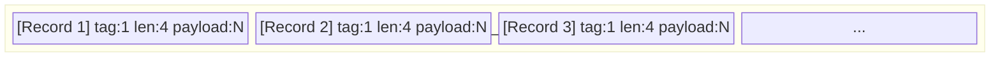
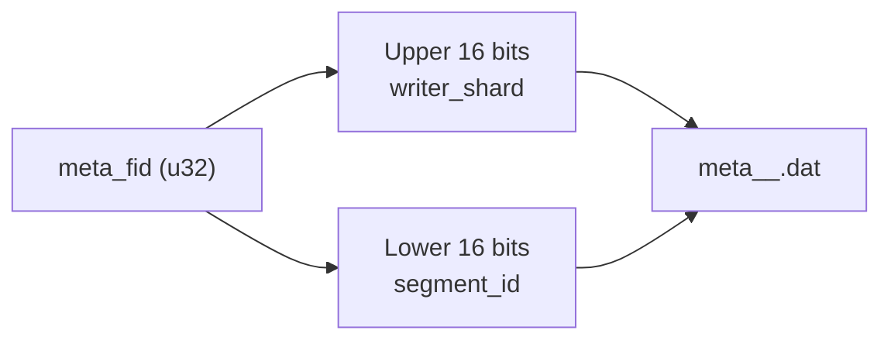
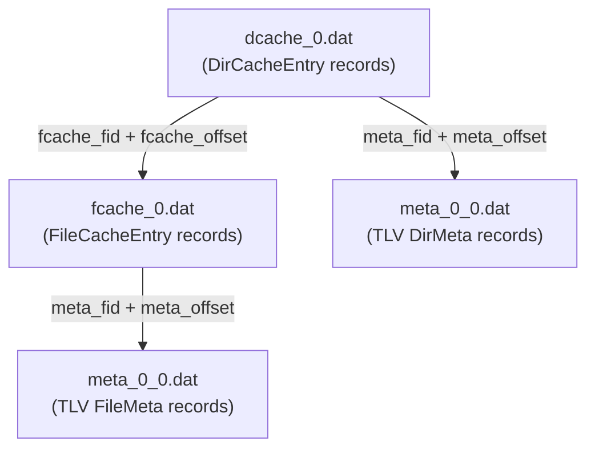

# Metadata Format

The metadata repository (M_REPO) stores full filesystem metadata for every scanned file and directory. Unlike control files (which describe *actions*), metadata files describe *state* -- the complete attributes of each entry at scan time. The format uses **Tag-Length-Value (TLV)** encoding for variable-length records and **fixed-size binary** for cache index entries.

## Core Data Structures

### MetaCommon

Shared metadata for both files and directories:

| Field | Type | Description |
|---|---|---|
| `id` | u64 | Unique ID: inode (Unix) or file index (Windows) |
| `mode` | u32 | File type and permission bits |
| `attr` | u32 | Windows `FILE_ATTRIBUTE_*` flags |
| `atime` | u32 | Access time (seconds since epoch) |
| `ctime` | u32 | Creation/change time (seconds since epoch) |
| `mtime` | u32 | Modification time (seconds since epoch) |
| `devno` | u64 | Device number (for mount boundary detection) |
| `name` | String | Base name (no parent path) |
| `security_descriptor` | Option\<String\> | Windows SDDL string |
| `posix_access_acl` | Option\<String\> | POSIX access ACL text |
| `posix_default_acl` | Option\<String\> | POSIX default ACL text |
| `symlink_target_path` | Option\<String\> | Symlink target (if symlink) |
| `xattributes` | Option\<String\> | Extended attributes |

### FileMeta

Extends `MetaCommon` with file-specific fields:

| Field | Type | Description |
|---|---|---|
| `common` | MetaCommon | Shared metadata |
| `size` | u64 | Logical file size in bytes |
| `links` | u64 | Hard link count |
| `sparse_range` | Option\<Vec\<(u64, u64)\>\> | Sparse regions as (offset, length) pairs |

### DirMeta

Extends `MetaCommon` with directory-specific fields:

| Field | Type | Description |
|---|---|---|
| `common` | MetaCommon | Shared metadata |
| `path` | String | Full absolute path |

## TLV Metadata Files

Metadata is stored in `.dat` files using a Tag-Length-Value encoding:



Each record:

| Field | Size | Description |
|---|---|---|
| Tag | 1 byte | `0x01` = DirMeta, `0x02` = FileMeta |
| Length | 4 bytes | Payload size in bytes (u32 LE) |
| Payload | N bytes | `bincode`-serialized `DirMeta` or `FileMeta` |

The `MetaFileWriter` tracks the current byte `offset` after each write. This offset is returned to the caller and stored in cache entries as `meta_offset`, enabling O(1) random access via `MetaRepoReader`.

## MetaFid -- Metadata File Identification

Each metadata file is identified by a 32-bit `meta_fid` (metadata file ID). The fid encodes two pieces of information:



| Component | Bits | Description |
|---|---|---|
| `writer_shard` | 16 (upper) | Writer thread ID (0-65535) |
| `segment_id` | 16 (lower) | Sequential segment within the shard |

Encoding: `meta_fid = (writer_shard << 16) | segment_id`

Decoding: `writer_shard = meta_fid >> 16`, `segment_id = meta_fid & 0xFFFF`

This design allows multiple writer threads to write to separate files without coordination. Each writer increments its own `segment_id` when a file grows too large.

### MetaEntryLocator

A `MetaEntryLocator` is a `(u32, u32)` tuple of `(meta_fid, offset)` that uniquely identifies a metadata record on disk. Cache entries store locators so the diff engine and backup pipeline can load full metadata on demand.

## Cache Index Files

For incremental diff performance, the scanner also writes compact **cache index** files alongside the full metadata:

### File Cache (`fcache_<fid>.dat`)

Contains `FileCacheEntry` records, sorted by `id` (inode):

| Field | Size | Description |
|---|---|---|
| `id` | 8 bytes | Inode / file index (u64) |
| `hash` | 4 bytes | First 4 bytes of SHA-256 of serialized FileMeta |
| `meta_fid` | 4 bytes | Metadata file ID |
| `meta_offset` | 4 bytes | Byte offset in metadata file |

Total: **20 bytes** per entry. Entries are stored sequentially with no padding.

### Directory Cache (`dcache_<fid>.dat`)

Contains `DirCacheEntry` records, sorted by `id`:

| Field | Size | Description |
|---|---|---|
| `id` | 8 bytes | Inode / file index (u64) |
| `hash` | 4 bytes | First 4 bytes of SHA-256 of serialized DirMeta |
| `meta_fid` | 4 bytes | Metadata file ID |
| `meta_offset` | 4 bytes | Byte offset in metadata file |
| `files_count` | 4 bytes | Number of files in this directory |
| `fcache_fid` | 4 bytes | File ID of the fcache file containing this directory's files |
| `fcache_offset` | 4 bytes | Byte offset within the fcache file |

Total: **32 bytes** per entry.



The `DirCacheEntry` acts as an index into the file cache: its `fcache_fid` and `fcache_offset` fields point to the first `FileCacheEntry` for that directory, and `files_count` tells how many consecutive entries to read.

## Repository Layout

A typical M_REPO directory:

```
meta/
  meta_0_0.dat          <-- TLV metadata (writer shard 0, segment 0)
  meta_0_1.dat          <-- TLV metadata (writer shard 0, segment 1)
  meta_1_0.dat          <-- TLV metadata (writer shard 1, segment 0)
  fcache_0.dat          <-- File cache entries
  fcache_1.dat
  dcache_0.dat          <-- Directory cache entries
  dcache_1.dat
```

The `MetaRepoReader` provides a unified interface that opens metadata files on demand (with an internal `HashMap` cache of open file handles) and reads any record by `(meta_fid, offset)`.

## Serialisation

All metadata structures use `bincode` for binary serialisation. Cache entries also use `bincode` but are fixed-size (`FixedSize` trait) to enable direct positional access without deserialising the entire file. The hash field in cache entries is computed as `SHA-256(bincode::serialize(meta))[0..4]` -- the first 4 bytes of the SHA-256 digest.
