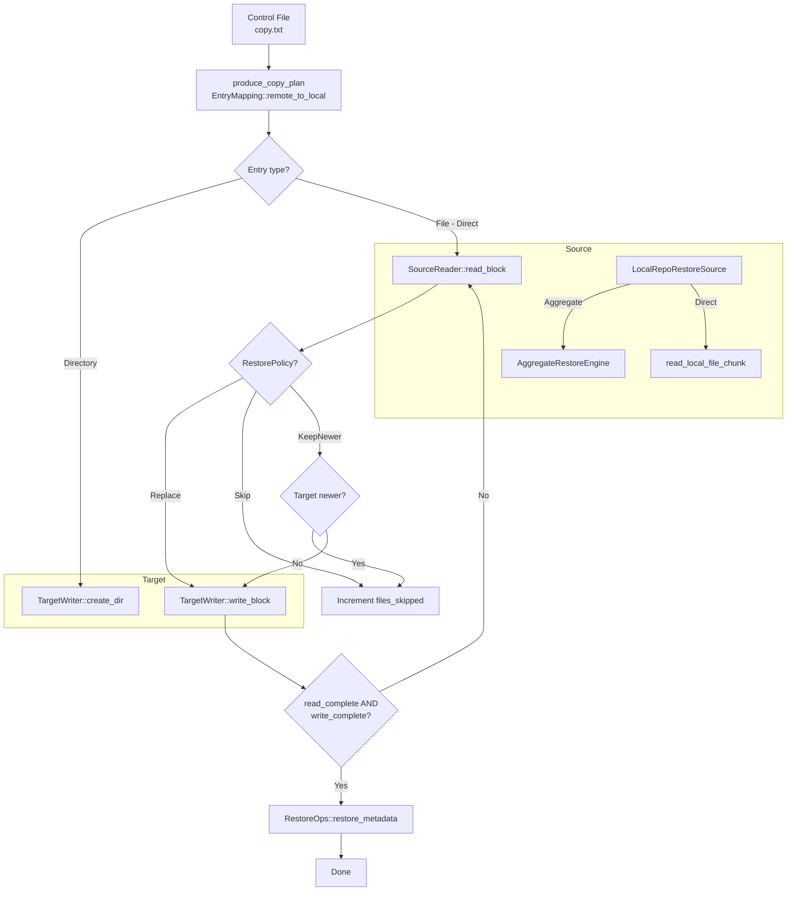

# Restore Pipeline

The restore pipeline reads data from the backup repository (D_REPO) and writes it to a target location -- local directory, NFS share, or SMB share. Unlike backup, restore always reads from the repository and writes to the destination, using the same control files and metadata that were produced during the scan.

## High-Level Flow



## RestoreSource

The `LocalRepoRestoreSource` implements the `SourceReader` trait and handles two cases:

1. **Aggregated files** -- Queries the aggregate index (binary or SQLite depending on layout), reads the file's data from the correct blob at the recorded offset and size
2. **Regular files** -- Reads the file directly from the D_REPO path

The index lookup is layout-aware:

| Layout | Index Location | Index Type |
|---|---|---|
| `DirLevel` | `<dir>/.AGGR_DIR/index.db` | SQLite |
| `Shard` | `.AGGR/index.bin` | Binary (`AggregateIndex`) |

An internal `index_cache` (per `LocalRepoRestoreSource` instance) avoids re-opening index files for every file lookup.

## RestorePolicy

When the restore target is a local directory, `RestorePolicy` controls how existing files are handled:

| Policy | Behaviour |
|---|---|
| `Replace` | Always overwrite the target (default) |
| `Skip` | Skip if the target file already exists |
| `KeepNewer` | Only restore if the backup version is newer than the target |

The policy is enforced by `should_skip_restore()`, which compares the source mtime (from `FileMeta`) with the target file's modification time via `std::fs::metadata`. For non-local targets, `Replace` semantics are always used and a warning is logged if a different policy was requested.

## RestoreOps Trait

Transport-specific operations are abstracted via the `RestoreOps` trait:

```rust
pub trait RestoreOps: Send + Sync {
    fn create_symlink(&self, link_path: &Path, target: &str) -> Result<(), String>;
    fn restore_metadata(&self, path: &Path, meta: &MetaCommon);
}
```

- **`create_symlink`** -- Creates a symbolic link. Only meaningful for local targets; remote transports no-op.
- **`restore_metadata`** -- Restores permissions, timestamps, xattrs, and ACLs after file content is written.

The local transport implements both methods. NFS and SMB transports handle metadata through their own transport-specific mechanisms.

## Symlink Handling

During restore, symlinks are detected via `meta.common.symlink_target_path`. When present, the pipeline calls `restore_ops.create_symlink()` instead of copying file content, then restores metadata on the link itself.

## Concurrency

The restore pipeline uses a semaphore-bounded concurrent task model:

1. A **producer** thread reads `copy.txt` and sends `CopyPlanEntry` items through an async channel
2. **Consumer tasks** (up to `max_concurrent_tasks`) process entries concurrently:
   - Directories are created via `TargetWriter::create_dir`
   - Files are read in chunks via `SourceReader::read_block` and written via `TargetWriter::write_block`
3. After all entries are processed, `source.finish()` and `target.finish()` are called for cleanup

## Error Handling

Failed files increment `files_failed` in the `RestoreStats`. The pipeline continues processing remaining entries even when individual files fail. Errors are logged with the logical path and error detail. The `RestoreTaskError::PartialFailure` variant is returned when any files failed, allowing callers to decide whether to retry or report.
