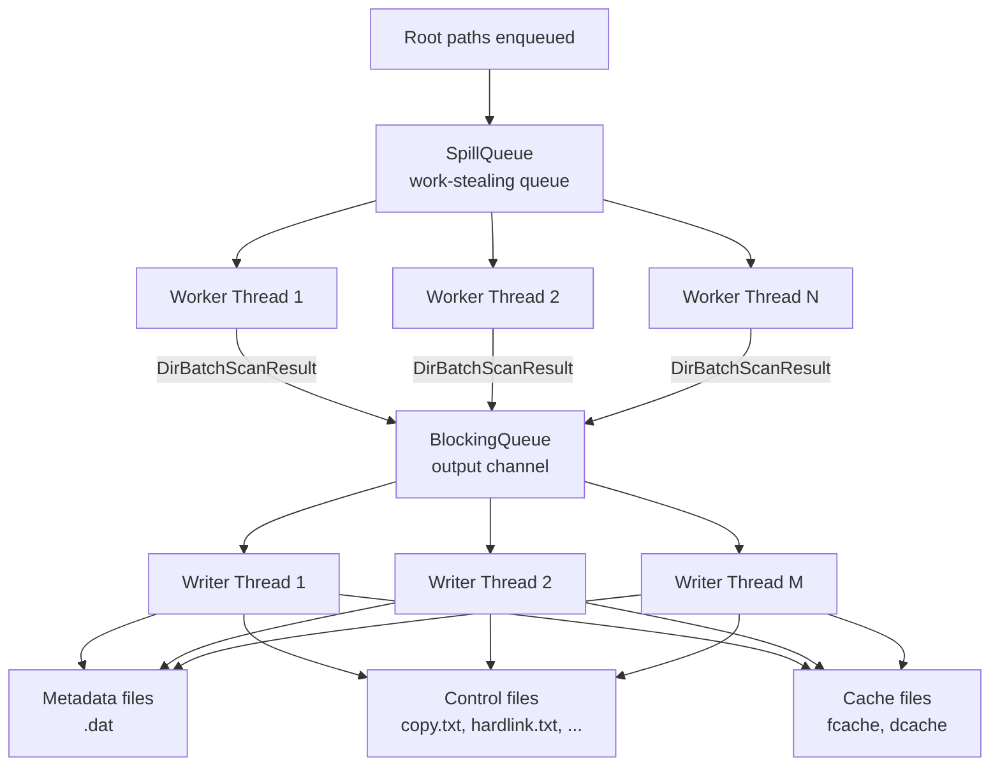
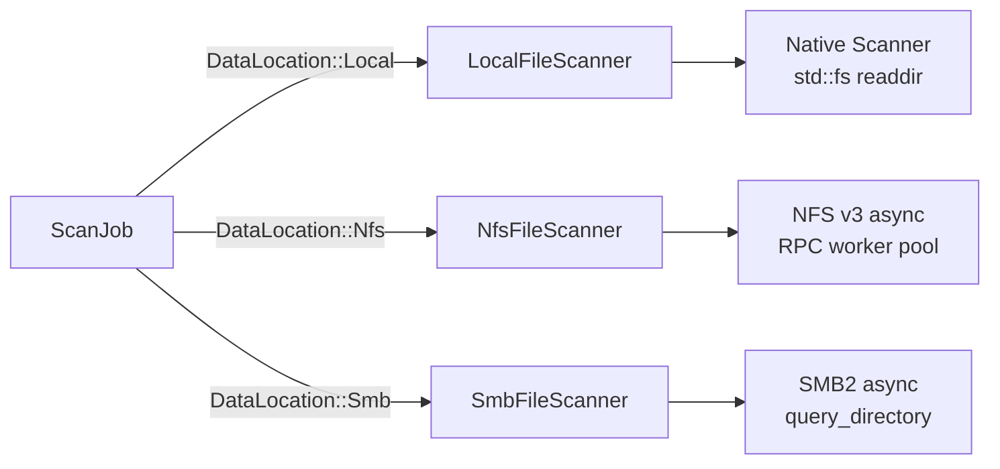

# Scan Engine

The scanner is the first stage of every backup operation. It walks a source directory tree -- local, NFS, or SMB -- collects file and directory metadata, detects hardlinks, and writes binary **control files** and **metadata** to the repository. The design prioritises throughput on trees with millions of entries through parallel traversal, spill-to-disk work queues, and sharded writer threads.

## High-Level Flow

## Key Components

### SpillQueue -- Work-Stealing Directory Queue

The `SpillQueue<T>` is a FIFO queue that transparently spills overflow entries to disk when the in-memory buffer exceeds a configurable upper bound. This prevents unbounded memory growth when scanning trees that contain millions of directories.

| Parameter | Purpose |
|---|---|
| `memory_upper_bound` | Maximum items kept in the in-memory `VecDeque` before spilling |
| `memory_lower_bound` | Target size after a spill-then-reload cycle (must be less than upper) |
| `spill_load_batch_size` | Number of items reloaded per disk read |
| `cache_dir` | Temporary directory for `.qcache.bin` spill files |

The queue guarantees FIFO ordering across memory and disk segments. Worker threads push discovered sub-directories into the `SpillQueue` and pop entries to process, achieving natural work-stealing without explicit steal logic.

### DirBatchScanResult

Each worker thread scans one directory at a time and produces a `DirBatchScanResult` containing:

- **File metadata** for every file in the directory (`FileMeta`)
- **Directory metadata** for child directories (`DirMeta`)
- **Hardlink candidates** detected via `nlink > 1` and `(device, inode)` pairs

Batches are sent through a `BlockingQueue` to the writer pool.

### Writer Threads

Writer threads consume `DirBatchScanResult` batches and write:

1. **Metadata** (`FileMeta` / `DirMeta`) to TLV-encoded `.dat` files via `MetaFileWriter`
2. **Cache entries** (`FileCacheEntry` / `DirCacheEntry`) to fixed-size `.dat` files for incremental diff
3. **Control files** (`copy.txt`, `hardlink.txt`, `delete.txt`, `mtime.txt`) using the binary control file codec
4. **Hardlink groups** via `HardlinkControlFileWriter` -- interleaving `Inode` and `File` records

Multiple writer threads can operate in parallel because metadata files are sharded by `writer_shard` (a thread-local ID encoded in the upper 16 bits of the `meta_file_id`).

### Scanner Path Filters

Before descending into a directory or emitting a file, the scanner consults `ScanPathFilterSet` which supports four filter dimensions:

| Filter | Method | Behaviour |
|---|---|---|
| Include dir patterns | `should_descend_dir()` | Only descend directories matching a glob |
| Include file patterns | `should_emit_file()` | Only emit files matching a glob |
| Exclude dir patterns | `should_descend_dir()` | Skip directories matching a glob |
| Exclude file patterns | `should_emit_file()` | Skip files matching a glob |

Patterns are compiled once at scan start. Exclusion takes precedence over inclusion for the same path.

## Transport-Specific Scanners

The scanner adapts to different source transports through a common `FileScanner` trait:

- **Local**: Uses `std::fs::read_dir` with the native `Scanner` engine and `SpillQueue`
- **NFS**: Spawns a Tokio runtime, connects via NFS v3, and fans out directory reads across an async worker pool with `async_channel`-based work distribution
- **SMB**: Uses SMB2 `QUERY_DIRECTORY` RPCs with configurable buffer sizes for efficient batch enumeration

All transport scanners emit the same `DirBatchScanResult` batches, so the writer pipeline is fully transport-agnostic.

## Configuration

The scanner is configured via `ScanOption` (low-level) or `ScannerConfig` (frame-level convenience):

| Option | Default | Description |
|---|---|---|
| `worker_count` | 4 | Parallel traversal threads |
| `writer_count` | 4 | Parallel metadata writer threads |
| `max_depth` | Unlimited | Maximum directory depth to traverse |
| `stats_only` | false | Collect stats only, skip disk output |
| `retry_policy` | 3 retries, 1s delay | Retry with exponential backoff and jitter |
| `enable_aggregation` | false | Also produce aggregate blob index files |
| `failure_log` | None | Structured JSON-lines failure log path |

## Lifecycle

The scanner follows a `TaskLifecycle` pattern: `start()` spawns background threads and returns a `RunningScan` handle, `is_complete()` polls for termination, and `get_stats()` returns a `ScanStatsSnapshot` with counts of files, directories, bytes, and failures.
