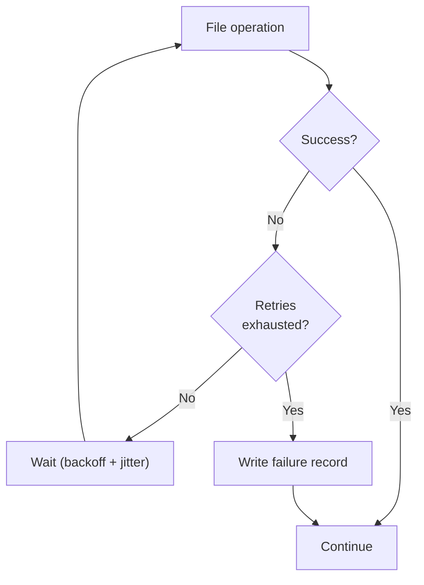
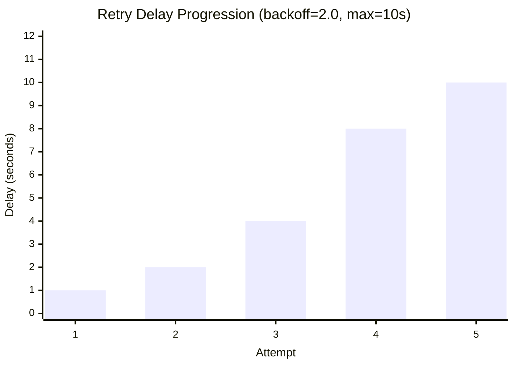

# Failure Handling

fpt-rs provides structured failure logging and configurable retry policies to handle transient I/O errors gracefully. This guide covers the failure log format, retry policy options, and how to use them effectively.

## Overview

When a file operation fails (copy, scan, NFS RPC, SMB read), fpt-rs follows this sequence:

1. **Retry** -- the operation is retried according to the configured retry policy (exponential backoff with optional jitter).
2. **Record** -- if all retries are exhausted, a structured failure record is written to the failure log.
3. **Continue** -- the backup/scan continues processing remaining files. The overall job completes with a non-zero exit code if any failures were recorded.



## Failure Log Format

Failure logs contain one record per failed file/directory/symlink. Three output formats are supported:

### CSV

```csv
time,phase,operation,item_type,path,code,detail,attempts
2026-06-07T14:30:05Z,copy,read,file,/data/projects/alpha.txt,EIO,Input/output error (os error 5),4
2026-06-07T14:30:12Z,scan,readdir,directory,/data/media/photos,ETIMEDOUT,Connection timed out,4
```

### JSON (JSON Lines inside array)

```json
[
  {
    "time": "2026-06-07T14:30:05Z",
    "phase": "copy",
    "operation": "read",
    "item_type": "file",
    "path": "/data/projects/alpha.txt",
    "code": "EIO",
    "detail": "Input/output error (os error 5)",
    "attempts": 4
  },
  {
    "time": "2026-06-07T14:30:12Z",
    "phase": "scan",
    "operation": "readdir",
    "item_type": "directory",
    "path": "/data/media/photos",
    "code": "ETIMEDOUT",
    "detail": "Connection timed out",
    "attempts": 4
  }
]
```

### XML

```xml
<failures>
  <failure><time>2026-06-07T14:30:05Z</time><phase>copy</phase><operation>read</operation><item_type>file</item_type><path>/data/projects/alpha.txt</path><code>EIO</code><detail>Input/output error (os error 5)</detail><attempts>4</attempts></failure>
</failures>
```

### Record Fields

| Field | Description |
|---|---|
| `time` | UTC timestamp in RFC 3339 format |
| `phase` | Operation phase: `scan`, `copy`, `hardlink`, `delete`, `mtime` |
| `operation` | Specific operation: `read`, `write`, `readdir`, `stat`, `unlink`, `utime`, `link` |
| `item_type` | Object type: `file`, `directory`, `symlink`, `special`, `block`, `unknown` |
| `path` | Logical path of the failed item |
| `code` | Classified error code (see below) |
| `detail` | Full error message from the OS/runtime |
| `attempts` | Total number of attempts made (1 initial + retries) |

## Error Classification

Errors are automatically classified into standard codes for easy filtering and aggregation:

### POSIX/OS Errors

| Code | Meaning | Typical Cause |
|---|---|---|
| `EACCES` | Permission denied | Insufficient file permissions |
| `EPERM` | Operation not permitted | Privileged operation required |
| `ENOENT` | No such file or directory | File deleted during scan/backup |
| `ENOSPC` | No space left on device | Target filesystem full |
| `EIO` | I/O error | Disk or network I/O failure |
| `ETIMEDOUT` | Connection timed out | Network timeout (NFS/SMB) |
| `ECONNRESET` | Connection reset | Network connection dropped |
| `ECONNREFUSED` | Connection refused | Server not listening |
| `EBUSY` | Resource busy | File locked by another process |
| `EROFS` | Read-only filesystem | Cannot write to target |
| `EEXIST` | File exists | Conflict during restore |
| `ENOTDIR` | Not a directory | Path component is a file |
| `EISDIR` | Is a directory | Expected file, found directory |

### Protocol-Specific Errors

| Code | Meaning | Protocol |
|---|---|---|
| `NFS3ERR_JUKEBOX` | Server busy, retry later | NFS |
| `NFS3ERR_ACCES` | NFS access denied | NFS |
| `NFS3ERR_NOENT` | NFS no such file | NFS |
| `NFS3ERR_NOSPC` | NFS no space | NFS |
| `NFS3ERR_IO` | NFS I/O error | NFS |
| `OBJECT_PATH_NOT_FOUND` | Path not found | SMB |
| `NETWORK_NAME_DELETED` | Share disconnected | SMB |
| `ACCESS_DENIED` | SMB access denied | SMB |
| `PERMISSION_DENIED` | SMB permission denied | SMB |

If no known pattern matches, the code is `UNKNOWN`.

## Enabling Failure Logs

### fptcli backup

```bash
./target/release/fptcli backup \
  --data /source \
  --target /backup \
  --failure-log-format json
```

The failure log is written to `C_REPO/logs/FSBACKUP_FAILURE.<ext>` inside the backup copy directory.

### fsscan

```bash
./target/release/fsscan /source/path \
  --failure-log-format csv \
  --failure-log /tmp/scan-failures.csv
```

If `--failure-log` is omitted, the log defaults to `<ctrl-dir>/SCAN_FAILURE.<ext>`.

### fsbackup

```bash
./target/release/fsbackup \
  --source-dir /source \
  --target-dir /backup \
  --meta-dir /tmp/fpt/meta \
  --control-file /tmp/fpt/ctrl/copy_xxx.control.bin \
  --failure-log-format xml
```

The log defaults to `<ctrl-dir>/FSBACKUP_FAILURE.<ext>`.

## Retry Policy Options

The retry policy controls how many times a failed operation is retried and how long to wait between attempts.

### CLI Flags

| Flag | Default | Description |
|---|---|---|
| `--operation-retries` | 3 | Maximum number of retry attempts before recording failure |
| `--retry-delay-ms` | 1000 | Base delay in milliseconds between retries |
| `--retry-backoff` | 1.0 | Exponential backoff multiplier (1.0 = fixed delay) |
| `--retry-max-delay-ms` | 1000 | Upper bound on delay after backoff is applied |
| `--retry-jitter` | 0.0 | Deterministic jitter ratio (0.0-1.0) to avoid thundering herd |

### Examples

**Fixed delay (default):** retry 3 times with 1 second between each attempt.

```bash
./target/release/fptcli backup \
  --data /source \
  --target /backup \
  --operation-retries 3 \
  --retry-delay-ms 1000
```

**Exponential backoff:** retry 5 times with doubling delay, capped at 10 seconds.

```bash
./target/release/fptcli backup \
  --data /source \
  --target /backup \
  --operation-retries 5 \
  --retry-delay-ms 1000 \
  --retry-backoff 2.0 \
  --retry-max-delay-ms 10000
```

Delay progression: 1s, 2s, 4s, 8s, 10s (capped).

**Backoff with jitter:** add randomness to avoid synchronized retries across parallel workers.

```bash
./target/release/fptcli backup \
  --data /source \
  --target /backup \
  --operation-retries 5 \
  --retry-delay-ms 2000 \
  --retry-backoff 2.0 \
  --retry-max-delay-ms 15000 \
  --retry-jitter 0.25
```

With `--retry-jitter 0.25`, each delay is varied by up to +/-25%. The jitter is deterministic per attempt (seeded from the attempt number), so it is reproducible across runs.

### Backoff Visualization



### Retry Policy Internals

The retry engine uses a queue-based approach:

1. A failed item is enqueued with a scheduled retry time (now + delay).
2. The worker sleeps until the retry time, then re-attempts the operation.
3. If the retry fails again and attempts remain, the item is re-enqueued with a longer delay.
4. If attempts are exhausted, the failure is recorded.

For NFS and SMB operations, the retry happens at the RPC level. For local file operations, it happens at the I/O syscall level.

## Post-Backup Triage

After a backup completes, check the failure log:

```bash
# Count failures by error code
cat COPY_*/C_REPO/logs/FSBACKUP_FAILURE.csv | \
  awk -F',' '{print $6}' | sort | uniq -c | sort -rn

# Show only permission errors
grep EACCES COPY_*/C_REPO/logs/FSBACKUP_FAILURE.json

# List all failed files
grep -o '"path":"[^"]*"' COPY_*/C_REPO/logs/FSBACKUP_FAILURE.json
```

### Common Remediation

| Error Pattern | Likely Cause | Remediation |
|---|---|---|
| Many `EACCES` errors | Permission mismatch | Run backup as a user with read access, or adjust source permissions |
| `ENOENT` during scan | Files being deleted | Normal for live filesystems; review if count is high |
| `ETIMEDOUT` on NFS | Network instability | Increase `--retry-backoff` and `--operation-retries` |
| `ENOSPC` on target | Target disk full | Free space on the target or use a different target |
| `EIO` sporadically | Disk/network hardware | Check hardware; consider running `fsck` or replacing cables |
| `NFS3ERR_JUKEBOX` | NFS server overloaded | Reduce `--nfs-connections`; retry with backoff |
