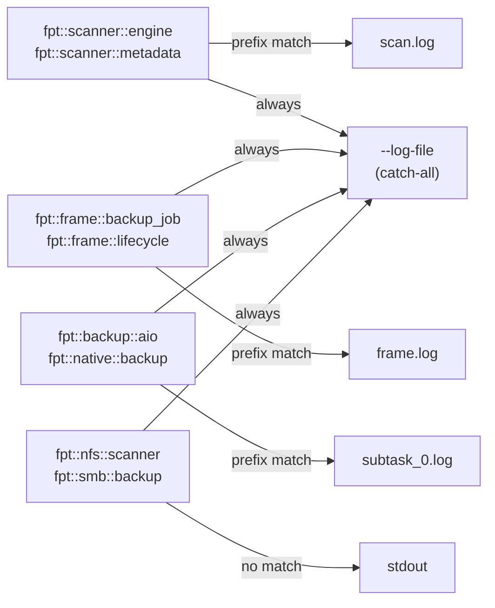

# Logging

fpt-rs uses a routing-based logging system that directs log records to specific files based on their Rust module path. This guide covers log verbosity, module-based routing, the `--log-file` flag, and structured failure logs.

## Log Format

All log lines follow a consistent format:

```
2026-06-07 14:30:00 [INFO] fpt::frame::backup_job - copy phase started
2026-06-07 14:30:01 [DEBUG] fpt::nfs::scanner - READDIRPLUS /export/dataset
2026-06-07 14:30:02 [WARN] fpt::backup::aio::executor - retry after EIO
```

Fields:
- **Timestamp** -- local time in `YYYY-MM-DD HH:MM:SS` format.
- **Level** -- `INFO`, `DEBUG`, or `TRACE`.
- **Target** -- Rust module path (e.g., `fpt::frame::backup_job`).
- **Message** -- the log message.

## Verbosity Levels

Control verbosity with the `-v` flag:

| Flag | Level | What You See |
|---|---|---|
| (none) | INFO | High-level progress: phase transitions, completion, errors |
| `-v` | INFO | Same as default (explicit) |
| `-vv` | DEBUG | Per-file operations, RPC calls, metadata writes |
| `-vvv` | TRACE | Full internal state: buffer allocations, queue depths, retry delays |

```bash
# Default verbosity
./target/release/fptcli backup --data /src --target /dst

# Debug output
./target/release/fptcli backup --data /src --target /dst -vv

# Full trace
./target/release/fptcli backup --data /src --target /dst -vvv
```

:::caution
TRACE verbosity generates a very large volume of output. Use it only when diagnosing specific issues and always combine it with `--log-file` to avoid flooding the terminal.
:::

## Module-Based Log Routing

The `RoutingLogger` directs log records to specific files based on the module path prefix. This means scanner logs, backup logs, and frame logs end up in separate files, making it easy to inspect each subsystem independently.

### How Routing Works

1. Each log record has a `target()` field (the Rust module path, e.g., `fpt::scanner::engine`).
2. The logger checks the target against registered routes, sorted longest-prefix-first.
3. If a route matches, the record goes to that route's file (not stdout).
4. If no route matches, the record goes to stdout.
5. All records also go to any catch-all files registered via `--log-file`.

### Built-In Routes

During a `fptcli backup` run, the framework automatically sets up routes:

| Module Prefix | Destination File | Content |
|---|---|---|
| `fpt::scanner` | `C_REPO/logs/scan.log` | Scanner traversal and metadata generation |
| `fpt::frame` | `C_REPO/logs/frame.log` | Job orchestration, subtask scheduling |
| `fpt::backup` | `C_REPO/logs/subtask_{N}.log` | Per-subtask copy/hardlink/delete/mtime operations |

Records from other modules (e.g., `fpt::nfs`, `fpt::smb`, the CLI binary itself) have no specific route and go to stdout.

### Routing Diagram



## The `--log-file` Flag

The `--log-file` flag adds a catch-all file that receives **every** log record regardless of routing. This is useful for capturing a complete trace of a run in a single file.

```bash
./target/release/fptcli backup \
  --data /source \
  --target /backup \
  --log-file /var/log/fpt/full-run.log \
  -vv
```

The file is opened in append mode, so multiple runs accumulate in the same file.

## Inspecting Logs After a Run

### Subtask Logs

Each subtask produces its own log file under `C_REPO/logs/`:

```bash
ls COPY_COMMON_FULL_<timestamp>/C_REPO/logs/
# scan.log  frame.log  subtask_0.log  subtask_1.log  ...
```

View a specific subtask's log:

```bash
cat COPY_COMMON_FULL_<timestamp>/C_REPO/logs/subtask_0.log
```

### Filtering by Level

Use `grep` to extract specific log levels:

```bash
# Show only warnings and errors
grep '\[WARN\]\|\[ERROR\]' COPY_COMMON_FULL_<timestamp>/C_REPO/logs/*.log

# Show only NFS-related messages
grep 'fpt::nfs' COPY_COMMON_FULL_<timestamp>/C_REPO/logs/*.log
```

## Structured Failure Logs

In addition to the standard text logs, fpt-rs can write structured failure logs in CSV, JSON, or XML format. These are covered in detail in the [Failure Handling](./failure-handling.md) guide.

Enable structured failure logs with:

```bash
./target/release/fptcli backup \
  --data /source \
  --target /backup \
  --failure-log-format json
```

The failure log is written to `C_REPO/logs/FSBACKUP_FAILURE.json`.

## Logging in Standalone Tools

### fsscan

```bash
./target/release/fsscan /source/path \
  --log-file /tmp/scan.log \
  -vv
```

### fsbackup

```bash
./target/release/fsbackup \
  --source-dir /source \
  --target-dir /backup \
  --meta-dir /tmp/fpt/meta \
  --control-file /tmp/fpt/ctrl/copy_xxx.control.bin \
  --log-file /tmp/fsbackup.log \
  -v
```

## Log Suppression

fpt-rs automatically suppresses noisy log messages from the SMB library (`smb::resource`) that are known to be harmless:

- `"Error closing file: ... Unexpected Message ..."`
- `"Error closing file: ... Network Name Deleted (0xc00000c9)"`

These typically occur during SMB session teardown and do not indicate actual data loss.
