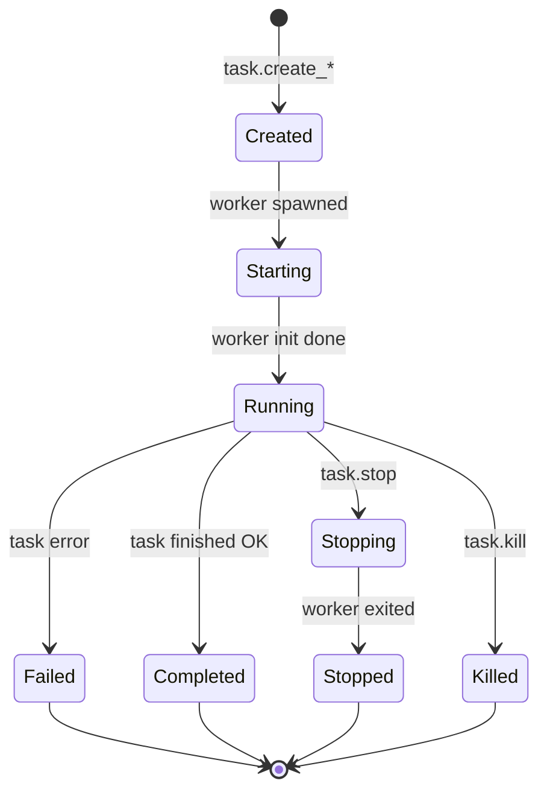

# fptserver Reference

`fptserver` is a long-running HTTP server that exposes backup, restore, and scan
operations as JSON-RPC and REST API endpoints. Clients submit tasks, and the
server spawns worker processes to execute them.

## Synopsis

```text
fptserver [OPTIONS]
```

## CLI Flags

| Flag                       | Default          | Description                                |
|----------------------------|------------------|--------------------------------------------|
| `--host <HOST>`            | `127.0.0.1`     | Bind address                               |
| `--port <PORT>`            | `3000`           | Listen port                                |
| `--runtime-dir <DIR>`      | `/tmp/fptserver` | Directory for task files, logs, status      |
| `--max-scanners-count <N>` | `1`              | Max concurrent scanner tasks               |
| `--max-subtasks-count <N>` | `4`              | Max concurrent subtask processes           |

## REST API

### Health Check

```http
GET /health
```

**Response:**

```json
{
  "status": "ok",
  "runtime_dir": "/tmp/fptserver",
  "max_scanners_count": 1,
  "max_subtasks_count": 4
}
```

### List All Tasks

```http
GET /tasks
```

**Response:** Array of `TaskStatusSnapshot` objects.

### Get Task Status

```http
GET /tasks/:uuid
GET /tasks/:uuid/status
```

**Response:** `TaskStatusSnapshot` object.

### Get Task Logs

```http
GET /tasks/:uuid/logs
```

**Response:** Plain text log output from the worker process.

## JSON-RPC API

All RPC calls go to `POST /rpc` with a JSON-RPC 2.0 request body.

### Request Format

```json
{
  "jsonrpc": "2.0",
  "id": 1,
  "method": "task.create_scan",
  "params": { ... }
}
```

### Response Format

```json
{
  "jsonrpc": "2.0",
  "id": 1,
  "result": { ... }
}
```

Or on error:

```json
{
  "jsonrpc": "2.0",
  "id": 1,
  "error": {
    "code": -32601,
    "message": "unknown method: ..."
  }
}
```

### RPC Methods

#### `task.create_scan`

Create a new scan task.

**Params:** `ScanTaskSpec`

```json
{
  "source": "/opt/dataset",
  "ctrl_dir": "/tmp/fpt/ctrl",
  "meta_dir": "/tmp/fpt/meta",
  "temp_dir": "/tmp/fpt/cache",
  "workers": 8,
  "writers": 1,
  "follow_symlinks": false,
  "scan_hidden": false,
  "max_depth": null,
  "scan_acl": false,
  "scan_xattrs": false,
  "scan_hardlinks": false,
  "skip_block_devices": true,
  "skip": [],
  "filters": {
    "include_dir_patterns": [],
    "include_file_patterns": [],
    "exclude_dir_patterns": [],
    "exclude_file_patterns": []
  },
  "prev_meta_dir": null,
  "shard": false,
  "shard_num": 16,
  "stats_only": false,
  "failure_log_format": null,
  "retry": {
    "operation_retries": 3,
    "retry_delay_ms": 1000,
    "retry_backoff": 1.0,
    "retry_max_delay_ms": 1000,
    "retry_jitter": 0.0
  },
  "verbose": 0
}
```

**Result:** `CreateTaskResponse`

#### `task.create_backup`

Create a new backup task.

**Params:** `BackupTaskSpec`

```json
{
  "source": "/opt/dataset",
  "target": "/backup/dataset",
  "format": "common",
  "incremental_base": null,
  "temp_dir": "/tmp/fpt",
  "scan_workers": 8,
  "scan_writers": 1,
  "jobs": 4,
  "aggregate": {
    "enabled": false,
    "layout": "shard",
    "blob_size_mb": 4,
    "threshold_kb": 1024,
    "shard_count": 16
  },
  "hardlink": false,
  "delete": false,
  "mtime": false,
  "scan_filters": { ... },
  "nfs_connections": 32,
  "smb_connections": 4,
  "smb_copy_tasks": 0,
  "buffer_size_kb": 1024,
  "failure_log_format": null,
  "retry": { ... },
  "verbose": 0
}
```

**Result:** `CreateTaskResponse`

#### `task.create_restore`

Create a new restore task.

**Params:** `RestoreTaskSpec`

```json
{
  "copy_source": "/backup/copy1",
  "target": "/restore",
  "policy": "replace",
  "temp_dir": "/tmp/fpt",
  "jobs": 4,
  "paths": [],
  "nfs_connections": 32,
  "verbose": 0
}
```

**Result:** `CreateTaskResponse`

#### `task.stop`

Gracefully stop a running task.

**Params:** `{ "uuid": "<task-uuid>" }`

**Result:** `TaskStatusSnapshot`

#### `task.kill`

Force-kill a running task's worker process.

**Params:** `{ "uuid": "<task-uuid>" }`

**Result:** `TaskStatusSnapshot`

#### `task.get`

Get the current status of a task.

**Params:** `{ "uuid": "<task-uuid>" }`

**Result:** `TaskStatusSnapshot`

#### `task.list` / `task.all`

List all known tasks.

**Result:** Array of `TaskStatusSnapshot`

## Task Lifecycle



### Task States

| State       | Description                                         |
|-------------|-----------------------------------------------------|
| `created`   | Task registered, worker not yet spawned             |
| `starting`  | Worker process spawned, initializing                |
| `running`   | Worker is actively executing the task               |
| `stopping`  | Graceful stop requested                             |
| `stopped`   | Worker exited after stop request                    |
| `completed` | Task finished successfully                          |
| `failed`    | Task encountered an error                           |
| `killed`    | Worker process was force-killed                     |

### TaskStatusSnapshot

The status snapshot returned by most endpoints:

```json
{
  "uuid": "550e8400-e29b-41d4-a716-446655440000",
  "kind": "backup",
  "state": "completed",
  "pid": 12345,
  "created_at": "2024-01-15T10:30:00Z",
  "started_at": "2024-01-15T10:30:01Z",
  "finished_at": "2024-01-15T10:45:00Z",
  "message": "task completed",
  "exit_code": 0,
  "stats": {
    "type": "transfer",
    "total_files": 15000,
    "total_dirs": 500,
    "total_bytes": 1073741824,
    "failed_files": 0,
    "failed_dirs": 0,
    "subtasks_ok": 4,
    "subtasks_failed": 0
  },
  "request": { ... }
}
```

### Task Stats Types

| Type      | Fields                                                         |
|-----------|----------------------------------------------------------------|
| `none`    | (no fields) -- task not yet producing stats                    |
| `scan`    | `total_files`, `total_dirs`, `total_size_bytes`, `failed_files`, `failed_dirs` |
| `transfer`| `total_files`, `total_dirs`, `total_bytes`, `failed_files`, `failed_dirs`, `subtasks_ok`, `subtasks_failed` |

## Task Runtime Structure

Each task gets a directory under `runtime_dir`:

```text
/tmp/fptserver/<uuid>/
    request.json    # Original task request
    status.json     # Current status snapshot (updated by worker)
    worker.log      # Worker stdout/stderr
```

The worker process is spawned as:

```text
fptserver worker --task-file <dir>/request.json --status-file <dir>/status.json
```

## Error Codes

| Code    | Meaning                              |
|---------|--------------------------------------|
| `-32600`| Invalid request                      |
| `-32601`| Method not found                     |
| `-32602`| Invalid params                       |
| `-32001`| Task limit exceeded                  |

## Examples

### Start the Server

```bash
fptserver --host 0.0.0.0 --port 8080 --runtime-dir /var/fptserver
```

### Create a Backup Task (curl)

```bash
curl -X POST http://localhost:8080/rpc \
  -H "Content-Type: application/json" \
  -d '{
    "jsonrpc": "2.0",
    "id": 1,
    "method": "task.create_backup",
    "params": {
      "source": "/opt/data",
      "target": "/backup/data",
      "format": "common",
      "jobs": 4,
      "verbose": 1
    }
  }'
```

### Poll Task Status

```bash
curl http://localhost:8080/tasks/<uuid>/status
```

### Get Task Logs

```bash
curl http://localhost:8080/tasks/<uuid>/logs
```
