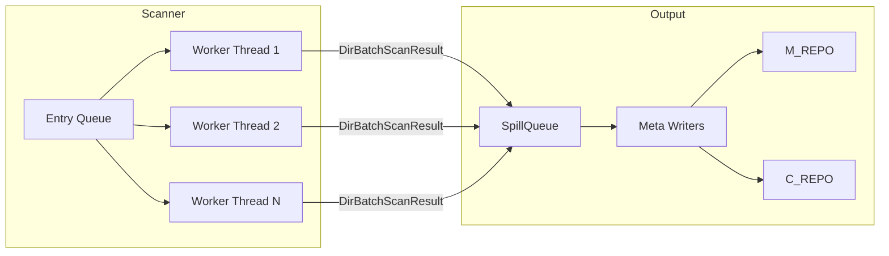
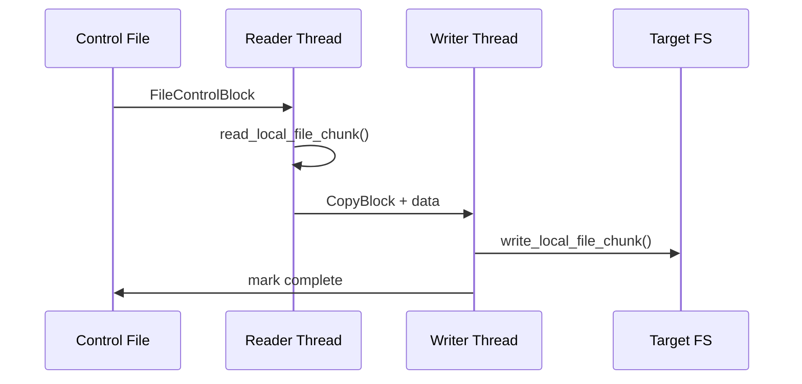

# Native / Local Transport

The native/local transport handles all operations on locally-mounted filesystems.
It is always compiled in (no feature flag required) and uses blocking OS threads
with `std::fs` for all I/O operations.

## Scanner

### BIO Traversal Workers

The local scanner (`src/native/scanner.rs`) uses a pool of OS threads to
traverse directories in parallel:



1. **Entry Queue** -- directories to scan are enqueued via `scanner.enqueue_path()`.
2. **Worker Threads** -- each worker dequeues a directory, calls `std::fs::read_dir()`,
   collects file metadata via `stat()`, and pushes a `DirBatchScanResult` into the
   output queue.
3. **SpillQueue** -- a bounded in-memory queue that spills to disk when memory usage
   exceeds a threshold, preventing OOM on large directory trees.
4. **Meta Writer Threads** -- consume batches from the SpillQueue, serialize metadata
   into `meta_*.dat` files and directory cache `dcache_*.dat` files in M_REPO.

### Scanner Configuration

The `ScannerConfig` struct controls local scanning:

| Field                     | Description                                              |
|---------------------------|----------------------------------------------------------|
| `ctrl_dir`                | Output directory for control files (C_REPO/ctrl)         |
| `meta_dir`                | Output directory for metadata files (M_REPO/meta)        |
| `worker_count`            | Number of traversal worker threads                       |
| `writer_count`            | Number of metadata writer threads                        |
| `prev_meta_dir`           | Previous metadata directory for incremental scanning     |
| `stats_only`              | Skip on-disk outputs, only collect statistics            |
| `enable_aggregation`      | Whether to store small files in aggregate blobs          |
| `max_aggregate_blob_size` | Maximum aggregate blob size in bytes                     |
| `aggregate_file_threshold`| Files smaller than this are aggregate candidates         |
| `failure_log`             | Optional failure log configuration                       |
| `retry_policy`            | Retry policy for scan operations                         |
| `path_filters`            | Compiled path include/exclude filter patterns            |

### Incremental Scanning

When `prev_meta_dir` is set, the scanner compares the current filesystem state
against the previous metadata. Only changed files are written to new control
files, significantly reducing backup time for large, mostly-static datasets.

## Backup Pipeline

### Blocking I/O Copy Engine

The local backup uses the BIO (Blocking I/O) pipeline for data transfer.
All reads and writes happen on dedicated OS threads:



### Post-Copy Phases

After all files are copied, the local transport runs three optional phases:


#### Hardlink Phase (`native/backup/hardlink.rs`)

Reads hardlink control files and creates hard links on the target. When multiple
source paths share the same inode, only one copy is written and the rest are
linked to it.

- Input: `hardlink_*.control.bin` files in C_REPO
- Output: hard links created on the target filesystem

#### Delete Phase (`native/backup/delete.rs`)

Removes files and directories that exist on the target but were deleted from the
source since the last backup.

- Input: `delete_*.control.bin` files in C_REPO
- Output: files and directories removed from the target

#### Mtime Phase (`native/backup/mtime.rs`)

Restores directory modification times to match the source. This must run after
all file copies and deletions are complete, since those operations change
directory mtimes.

- Input: `mtime_*.control.bin` files in C_REPO
- Output: directory mtimes restored on the target

### Phase Implementation

All three phases are implemented in `src/native/backup/phases_impl.rs` via the
`PostCopyPhases` trait:

```rust
pub struct LocalPostCopyPhases;

impl PostCopyPhases for LocalPostCopyPhases {
    async fn run_hardlink_phase(&self, ctrl_dir, ...) { ... }
    async fn run_delete_phase(&self, ctrl_dir, ...) { ... }
    async fn run_mtime_phase(&self, ctrl_dir, ...) { ... }
}
```

## Restore Pipeline

### Local Restore

The local restore reads data from the backup copy (D_REPO staging directory)
and writes it to the target path using `std::fs`:

```text
D_REPO (staging) --> read_local_file_chunk() --> write_local_file_chunk() --> target path
```

### RestoreOps Implementation

The `LocalRestoreOps` struct (`src/native/backup/restore_ops.rs`) implements
transport-specific restore operations:

```rust
pub struct LocalRestoreOps;

impl RestoreOps for LocalRestoreOps {
    fn create_symlink(&self, link_path: &Path, target: &str) -> Result<(), String> {
        // Create symbolic link on local filesystem
    }

    fn restore_metadata(&self, path: &Path, meta: &MetaCommon) {
        // Restore permissions, timestamps, xattrs, ACLs
    }
}
```

## Key Source Files

| File                               | Purpose                                    |
|------------------------------------|--------------------------------------------|
| `src/native/scanner.rs`            | Blocking I/O directory traversal           |
| `src/native/backup/local_copy.rs`  | Local file read/write operations           |
| `src/native/backup/local_block.rs` | Block-level copy helpers                   |
| `src/native/backup/hardlink.rs`    | Hardlink creation phase                    |
| `src/native/backup/delete.rs`      | Delete phase                               |
| `src/native/backup/mtime.rs`       | Mtime restoration phase                    |
| `src/native/backup/phases_impl.rs` | `PostCopyPhases` trait implementation      |
| `src/native/backup/restore_ops.rs` | `RestoreOps` trait implementation          |
| `src/native/fstat.rs`              | File stat helpers                          |
| `src/native/fwrite_meta.rs`        | Metadata write helpers                     |
| `src/backup/aio/transport.rs`      | `LocalSource` / `LocalTarget` structs      |
