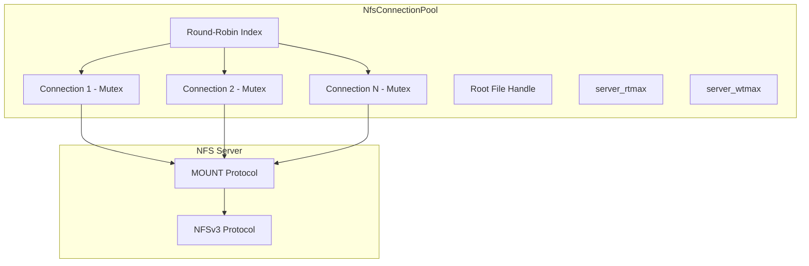
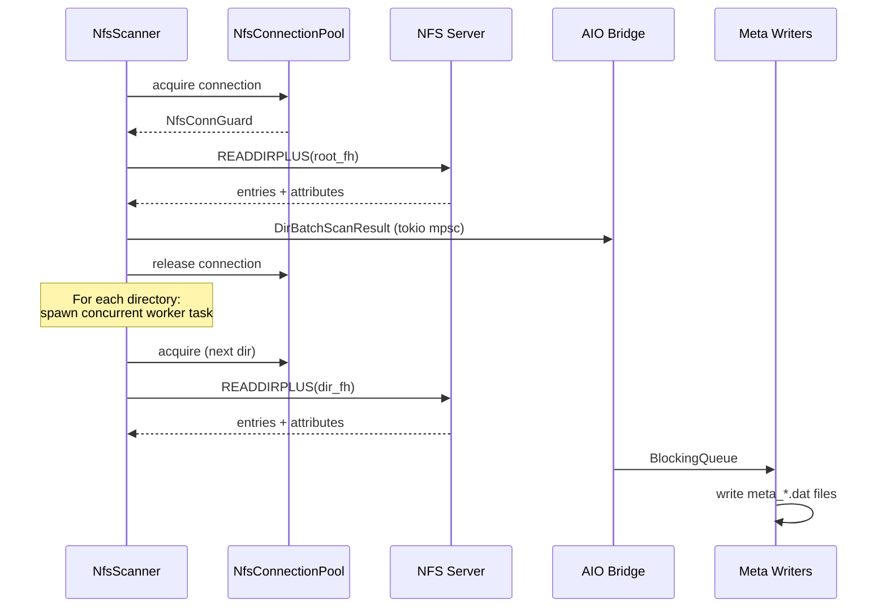

# NFS Transport

The NFS transport enables fpt-rs to read from and write to NFSv3 exports using
direct RPC calls via the `nfs3_client` crate. No kernel NFS mount is required --
fpt-rs communicates with the NFS server entirely in userspace.

:::info Feature Flag
The NFS transport is gated behind the `nfs` Cargo feature. Build with
`--features nfs` to enable it.
:::

## NFS URL Format

NFS locations are specified as URLs with the `nfs://` scheme:

```text
nfs://host[:port]/export[?sub=path][&uid=N][&gid=N]
```

### Components

| Component   | Required | Description                                    |
|-------------|----------|------------------------------------------------|
| `host`      | Yes      | NFS server hostname or IP address              |
| `port`      | No       | NFS port (default: 2049, mountd auto-detected) |
| `export`    | Yes      | NFS export path (e.g. `/data`)                 |
| `sub`       | No       | Sub-path within the export                     |
| `uid`       | No       | AUTH_UNIX uid (default: 0)                     |
| `gid`       | No       | AUTH_UNIX gid (default: 0)                     |

### Examples

```text
nfs://192.168.1.10/export
nfs://nas.local/data?sub=/dataset1
nfs://10.0.0.5/volume1?sub=/backups&uid=1000&gid=1000
nfs://192.168.1.10:2050/export?sub=/ds1
```

## NfsConnectionPool

The `NfsConnectionPool` (`src/nfs/connection.rs`) manages a pool of TCP
connections to the NFS server:



### Pool Initialization

When `NfsConnectionPool::new(location)` is called:

1. **Mount** -- Each connection calls the MOUNT protocol to obtain the export's
   root file handle (`nfs_fh3`).
2. **FSINFO** -- Queries the server for maximum read/write transfer sizes
   (`rtmax`, `wtmax`).
3. **Sub-path resolution** -- If `location.sub_path` is non-empty, walks from
   the export root via LOOKUP RPCs to resolve the effective root file handle.
4. **AUTH_UNIX** -- If uid/gid are configured, wraps each connection with
   `auth_unix` credentials so the server sees the correct identity.

### Connection Acquisition

```rust
// Round-robin selection with mutex-based backpressure
let guard = pool.acquire().await;
// guard derefs to PooledConnection -- use for NFS RPCs
// mutex released when guard is dropped
```

## NfsScanner

The `NfsScanner` (`src/nfs/scanner.rs`) traverses NFS directories using the
**READDIRPLUS** NFSv3 operation, which returns both directory entries and their
attributes in a single RPC:



### Concurrency Model

- A `tokio::sync::Semaphore` limits the number of concurrent READDIRPLUS RPCs
  to `location.connection_count`.
- Each directory is processed by a separate tokio task.
- Results are batched into `DirBatchScanResult` and sent through a tokio mpsc
  channel.
- The AIO bridge in `run_aio_scan()` forwards batches to the `BlockingQueue`
  for the metadata writer threads.

### NfsScanAdapter

The `NfsScanAdapter` wraps `NfsScanner` and implements the `AsyncDirScanner`
trait, bridging the scanner-specific parameters (root_fh, root_path) into the
generic async scan interface:

```rust
pub(crate) struct NfsScanAdapter {
    pub scanner: NfsScanner,
    pub root_fh: nfs_fh3,
    pub root_path: String,
}

impl AsyncDirScanner for NfsScanAdapter {
    type Error = NfsError;

    fn scan(self, scan_option, tx) -> Pin<Box<dyn Future<...>>> {
        Box::pin(async move {
            self.scanner.scan(self.root_fh, self.root_path, &scan_option, tx).await
        })
    }
}
```

## Backup Pipeline

### NfsSource (SourceReader)

`NfsSource` (`src/nfs/backup/transport.rs`) implements `SourceReader` for reading
data from NFS:

```rust
pub struct NfsSource {
    pub pool: Arc<NfsConnectionPool>,
    pub dir_cache: FileHandleCache,  // path -> file handle cache
    pub root_fh: nfs_fh3,
    pub read_chunk: u32,             // max bytes per READ RPC
    pub buffer_size: usize,
}
```

- Acquires a connection from the pool for each read.
- Uses a `FileHandleCache` to avoid repeated LOOKUP RPCs for the same file.
- Reads in chunks up to `min(read_chunk, server_rtmax, buffer_size)`.

### NfsTarget (TargetWriter)

`NfsTarget` implements `TargetWriter` for writing data to NFS:

```rust
pub struct NfsTarget {
    pub pool: Arc<NfsConnectionPool>,
    pub dir_cache: DirHandleCache,  // path -> dir handle cache
    pub root_fh: nfs_fh3,
    pub write_chunk: u32,           // max bytes per WRITE RPC
    pub buffer_size: usize,
}
```

- `create_dir()` -- uses `get_or_create_dir()` which caches directory handles
  and creates directories via MKDIR RPCs as needed.
- `write_block()` -- writes data in chunks up to `min(write_chunk, server_wtmax)`.
  Creates files via CREATE RPCs on first write, then uses WRITE RPCs.

### Post-Copy Phases

The `NfsPostCopyPhases` struct implements all three post-copy phases using NFS
RPCs:

| Phase     | NFS Operations Used              |
|-----------|----------------------------------|
| Hardlink  | LOOKUP + LINK RPCs               |
| Delete    | LOOKUP + REMOVE / RMDIR RPCs     |
| Mtime     | LOOKUP + SETATTR RPCs            |

All phases share the same `NfsConnectionPool`, `FileHandleCache`, and
`DirHandleCache` for efficient handle reuse.

## Key Source Files

| File                           | Purpose                                    |
|--------------------------------|--------------------------------------------|
| `src/nfs.rs`                   | `NfsLocation` struct and URL parser        |
| `src/nfs/connection.rs`        | `NfsConnectionPool` and `NfsConnGuard`     |
| `src/nfs/scanner.rs`           | `NfsScanner` and `NfsScanAdapter`          |
| `src/nfs/backup/transport.rs`  | `NfsSource` / `NfsTarget` implementations  |
| `src/nfs/backup/reader.rs`     | NFS READ RPC helpers and file handle cache |
| `src/nfs/backup/writer.rs`     | NFS WRITE/MKDIR helpers and dir handle cache |
| `src/nfs/backup/hardlink.rs`   | NFS hardlink phase (LINK RPCs)             |
| `src/nfs/backup/delete.rs`     | NFS delete phase (REMOVE/RMDIR RPCs)       |
| `src/nfs/backup/mtime.rs`      | NFS mtime phase (SETATTR RPCs)             |
| `src/nfs/backup/phases_impl.rs`| `PostCopyPhases` trait implementation      |
| `src/nfs/error.rs`             | `NfsError` error type                      |
