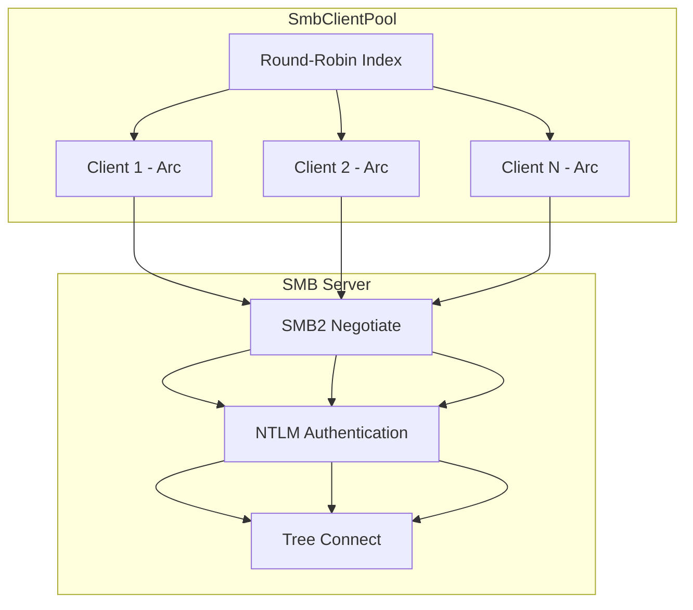
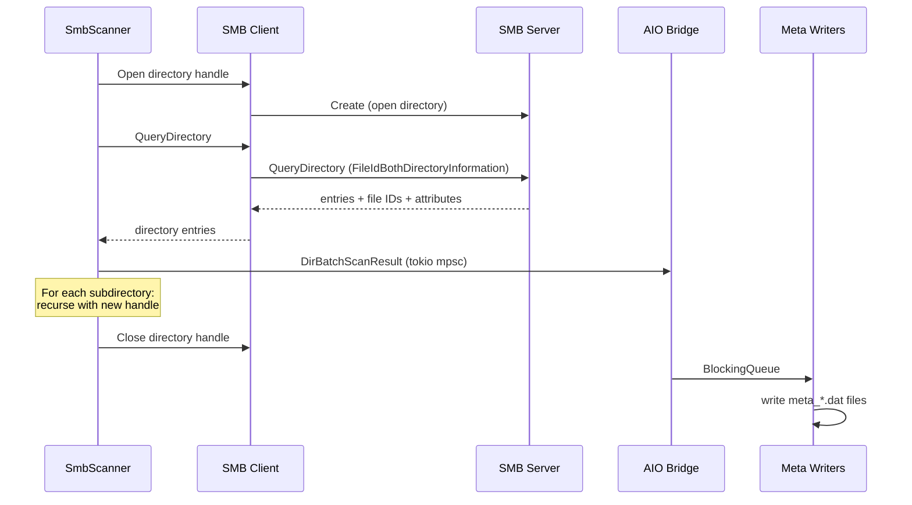
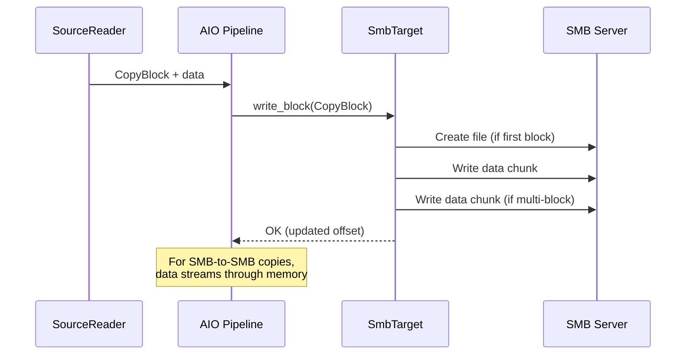

# SMB Transport

The SMB transport enables fpt-rs to read from and write to SMB/CIFS file shares
using an async SMB2/3 client. It supports Windows shares, Samba, and any
SMB2-compatible server.

:::info Feature Flag
The SMB transport is gated behind the `smb` Cargo feature. Build with
`--features smb` to enable it.
:::

## SMB URL Format

SMB locations are specified as URLs with the `smb://` or `smb://` scheme:

```text
smb://host[:port]/share[/sub-path][?username=u&password=p]
smb:\\host\share[\sub-path][?username=u&password=p]
```

### Components

| Component   | Required | Description                                      |
|-------------|----------|--------------------------------------------------|
| `host`      | Yes      | SMB server hostname or IP address                |
| `port`      | No       | SMB port (default: 445)                          |
| `share`     | Yes      | SMB share name (e.g. `backups`)                  |
| `sub-path`  | No       | Sub-path within the share                        |
| `username`  | No       | Authentication username                          |
| `password`  | No       | Authentication password                          |

### Examples

```text
smb://192.168.1.10/backups
smb://nas.local/data/root?username=admin&password=secret
smb://10.0.0.5/share/dataset1?username=backup&password=pass
smb:\\server\share\path?username=u&password=p
```

### Display Form

The `display_string()` method redacts the password for safe logging:

```text
smb://192.168.1.10/backups?username=admin
```

## SmbClientPool

The `SmbClientPool` (`src/smb/connection.rs`) manages a pool of authenticated
SMB client connections:



### Pool Initialization

`SmbClientPool::connect(location, size)` performs for each client:

1. **Connect** -- TCP connection to `host:port`.
2. **Negotiate** -- SMB2 protocol negotiation (SMB2-only mode, NTLM auth).
3. **Authenticate** -- NTLM authentication with the provided username/password.
4. **Tree Connect** -- Connect to the share (`\\host\share`).

### Client Acquisition

```rust
// Round-robin selection -- no locking needed (Arc<Client> is clone-safe)
let client = pool.client();
// Use client for SMB operations
```

### Directory Cache

The `DirCache` (`smb::connection::DirCache`) is a shared `HashSet<String>` that
tracks directories known to exist, avoiding redundant MKDIR RPCs during backup:

```rust
pub type DirCache = Arc<Mutex<HashSet<String>>>;
```

## SmbScanner

The `SmbScanner` (`src/smb/scanner.rs`) traverses SMB shares using the
**QueryDirectory** SMB2 operation with `FileIdBothDirectoryInformation`
information class:



### SmbScanAdapter

The `SmbScanAdapter` wraps `SmbScanner` and implements `AsyncDirScanner`:

```rust
pub(crate) struct SmbScanAdapter {
    pub scanner: SmbScanner,
}

impl AsyncDirScanner for SmbScanAdapter {
    type Error = String;

    fn scan(self, scan_option, tx) -> Pin<Box<dyn Future<...>>> {
        Box::pin(async move { self.scanner.scan(&scan_option, tx).await })
    }
}
```

## Backup Pipeline

### SmbTarget (TargetWriter)

`SmbTarget` (`src/smb/backup/transport.rs`) implements `TargetWriter` for writing
data to SMB shares:

```rust
pub struct SmbTarget {
    pub location: SmbLocation,
    pub pool: Arc<SmbClientPool>,
    pub dir_cache: DirCache,
    pub buffer_size: usize,
}
```

- **`create_dir()`** -- uses `ensure_relative_directory()` which checks the
  `DirCache` before issuing MKDIR RPCs. Directories are created relative to the
  share root (or sub-path).
- **`write_block()`** -- opens or creates the target file, writes data in chunks
  using SMB2 WRITE operations, then closes the file handle.
- **`finish()`** -- closes all connections in the pool.

### Streaming Copy

The SMB backup pipeline uses a streaming copy model:



The copy buffer size is clamped between 256 KB and 4 MB. SMB source reads are
capped at 2048 KiB; SMB writes stay capped at 256 KiB per operation.

### SMB Post-Copy Phases

The `SmbPostCopyPhases` struct implements post-copy phases using SMB operations:

| Phase     | SMB Operations Used                           |
|-----------|-----------------------------------------------|
| Hardlink  | SMB2 IOCTL (FSCTL_SET_SPARSE + hardlink)      |
| Delete    | SMB2 SetInfo (disposition delete) + Close      |
| Mtime     | SMB2 SetInfo (basic information) + Close       |

### SmbClient Configuration

The SMB client is configured with these defaults (from `smb::client_config()`):

| Setting                       | Value   |
|-------------------------------|---------|
| DFS                           | Disabled |
| Kerberos                      | Disabled |
| NTLM                          | Enabled  |
| Compression                   | Disabled |
| Notifications                 | Disabled |
| SMB2-only negotiate           | Enabled  |
| Unsigned guest access         | Enabled  |

## Key Source Files

| File                           | Purpose                                       |
|--------------------------------|-----------------------------------------------|
| `src/smb.rs`                   | `SmbLocation` struct and URL parser           |
| `src/smb/connection.rs`        | `SmbClientPool` and `DirCache`                |
| `src/smb/scanner.rs`           | `SmbScanner` and `SmbScanAdapter`             |
| `src/smb/backup/transport.rs`  | `SmbTarget` (TargetWriter implementation)     |
| `src/smb/backup/writer.rs`     | SMB write/mkdir helpers                       |
| `src/smb/backup/executor.rs`   | SMB streaming copy orchestrator               |
| `src/smb/backup/hardlink.rs`   | SMB hardlink phase                            |
| `src/smb/backup/delete.rs`     | SMB delete phase                              |
| `src/smb/backup/mtime.rs`      | SMB mtime phase                               |
| `src/smb/backup/phases_impl.rs`| `PostCopyPhases` trait implementation         |
| `src/smb/backup/pipeline.rs`   | SMB backup pipeline orchestration             |
| `src/smb/backup/metrics.rs`    | SMB transfer metrics                          |
| `src/smb/fstat.rs`             | SMB file stat helpers                         |
