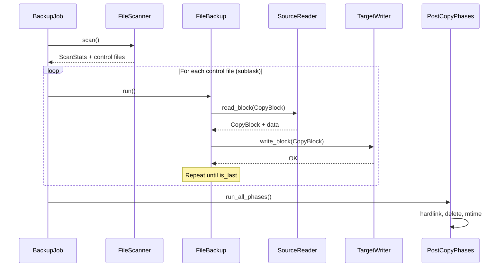

# Trait System

fpt-rs uses a trait-based architecture to decouple the backup/restore pipeline
from specific transport implementations. This page documents each trait, its
purpose, and how the three transports implement it.

## Trait Hierarchy

```mermaid
classDiagram
    class FileScanner {
        <<trait>>
        +scan() Result~ScanStats, Error~
    }

    class FileBackup {
        <<trait>>
        +run() Result~TransferStats, Error~
    }

    class FileRestore {
        <<trait>>
        +run() Result~TransferStats, Error~
    }

    class BackupRestoreJob {
        <<trait>>
        +run() Result~JobResult, Error~
    }

    class AsyncDirScanner {
        <<trait>>
        +scan(scan_option, tx) Pin~Box~Future~~
    }

    class SourceReader {
        <<trait>>
        +read_block(block) BoxFuture~CopyBlock~
        +finish() BoxFuture
    }

    class TargetWriter {
        <<trait>>
        +create_dir(path) BoxFuture
        +write_block(block) BoxFuture~CopyBlock~
        +write_file(fcb) BoxFuture~FCB~
        +finish() BoxFuture
    }

    class PostCopyPhases {
        <<trait>>
        +run_hardlink_phase() async
        +run_delete_phase() async
        +run_mtime_phase() async
        +run_all_phases() async
    }

    class RestoreOps {
        <<trait>>
        +create_symlink(path, target) Result
        +restore_metadata(path, meta)
    }

    FileScanner <|.. LocalFileScanner
    FileScanner <|.. NfsFileScanner
    FileScanner <|.. SmbFileScanner

    FileBackup <|.. LocalFileBackup
    FileBackup <|.. NfsSourceTargetFileBackup
    FileBackup <|.. SmbSourceTargetFileBackup

    FileRestore <|.. LocalFileRestore
    FileRestore <|.. NfsFileRestore

    AsyncDirScanner <|.. NfsScanAdapter
    AsyncDirScanner <|.. SmbScanAdapter

    SourceReader <|.. LocalSource
    SourceReader <|.. NfsSource

    TargetWriter <|.. LocalTarget
    TargetWriter <|.. NfsTarget
    TargetWriter <|.. SmbTarget

    PostCopyPhases <|.. LocalPostCopyPhases
    PostCopyPhases <|.. NfsPostCopyPhases
    PostCopyPhases <|.. SmbPostCopyPhases

    RestoreOps <|.. LocalRestoreOps
```



## Frame-Level Traits

These traits are defined in `src/frame/traits.rs` and provide the high-level
job orchestration interface.

### `FileScanner`

```rust
pub trait FileScanner {
    type Error: std::error::Error + Send + 'static;
    fn scan(&self) -> Result<ScanStats, Self::Error>;
}
```

Executes a full directory scan and writes metadata/control files to disk.
The call blocks until the scan is complete. NFS/SMB implementations spin up
their own Tokio runtime internally.

**Implementations:**

| Struct               | Transport | Module                        |
|----------------------|-----------|-------------------------------|
| `LocalFileScanner`   | Local     | `src/frame/scanner_impls.rs`  |
| `NfsFileScanner`     | NFS       | `src/frame/scanner_impls.rs`  |
| `SmbFileScanner`     | SMB       | `src/frame/scanner_impls.rs`  |

### `FileBackup`

```rust
pub trait FileBackup {
    type Error: std::error::Error + Send + 'static;
    fn run(&self) -> Result<TransferStats, Self::Error>;
}
```

Executes one backup subtask (one control file). Reads source data and writes
to the target using the appropriate transport pipeline.

**Implementations (9 total -- all source/target combinations):**

| Struct                         | Source | Target | Module                        |
|--------------------------------|--------|--------|-------------------------------|
| `LocalFileBackup`              | Local  | Local  | `src/frame/backup_impls.rs`   |
| `NfsFileBackup`                | Local  | NFS    | `src/frame/backup_impls.rs`   |
| `SmbFileBackup`                | Local  | SMB    | `src/frame/backup_impls.rs`   |
| `NfsSourceLocalTargetFileBackup`| NFS   | Local  | `src/frame/backup_impls.rs`   |
| `NfsSourceTargetFileBackup`    | NFS    | NFS    | `src/frame/backup_impls.rs`   |
| `NfsSourceSmbTargetFileBackup` | NFS    | SMB    | `src/frame/backup_impls.rs`   |
| `SmbSourceLocalTargetFileBackup`| SMB   | Local  | `src/frame/backup_impls.rs`   |
| `SmbSourceNfsTargetFileBackup` | SMB    | NFS    | `src/frame/backup_impls.rs`   |
| `SmbSourceTargetFileBackup`    | SMB    | SMB    | `src/frame/backup_impls.rs`   |

### `FileRestore`

```rust
pub trait FileRestore {
    type Error: std::error::Error + Send + 'static;
    fn run(&self) -> Result<TransferStats, Self::Error>;
}
```

Executes one restore subtask. Reads from the backup copy and writes to the
restore target.

**Implementations:**

| Struct              | Target | Module                         |
|---------------------|--------|--------------------------------|
| `LocalFileRestore`  | Local  | `src/frame/restore_impls.rs`   |
| `NfsFileRestore`    | NFS    | `src/frame/restore_impls.rs`   |
| `SmbFileRestore`    | SMB    | `src/frame/restore_impls.rs`   |

### `BackupRestoreJob`

```rust
pub trait BackupRestoreJob {
    type Error: std::error::Error + Send + 'static;
    fn run(self) -> Result<JobResult, Self::Error>;
}
```

Drives the complete four-phase pipeline (prerequisite, scan, subtasks, post-job)
in a single blocking call.

**Implementations:**

| Struct            | Direction | Module                        |
|-------------------|-----------|-------------------------------|
| `FileBackupJob`   | Backup    | `src/frame/backup_job.rs`     |
| `FileRestoreJob`  | Restore   | `src/frame/restore_job.rs`    |

## AIO Pipeline Traits

These traits are defined in `src/backup/aio/` and power the async copy pipeline
used by NFS and SMB transports.

### `AsyncDirScanner`

```rust
pub trait AsyncDirScanner: Send + 'static {
    type Error: std::fmt::Display + Send + 'static;
    fn scan(
        self,
        scan_option: Arc<ScanOption>,
        tx: tokio::sync::mpsc::Sender<DirBatchScanResult>,
    ) -> Pin<Box<dyn Future<Output = Result<(), Self::Error>> + Send>>;
}
```

Abstracts over protocol-specific async directory scanners. Both NFS and SMB
scanners implement this trait (via adapter structs) so the shared
`run_aio_scan()` function can drive either one.

**Implementations:**

| Adapter           | Wraps          | Module                        |
|-------------------|----------------|-------------------------------|
| `NfsScanAdapter`  | `NfsScanner`   | `src/nfs/scanner.rs`          |
| `SmbScanAdapter`  | `SmbScanner`   | `src/smb/scanner.rs`          |

### `SourceReader`

```rust
pub trait SourceReader: Clone + Send + Sync + 'static {
    fn read_block(
        &self,
        block: CopyBlock,
    ) -> BoxFuture<'static, Result<CopyBlock, (CopyBlock, String)>>;

    fn finish(&self) -> BoxFuture<'static, Result<(), String>> {
        Box::pin(async { Ok(()) })
    }
}
```

Reads data blocks from a source location. Each `read_block()` call returns a
`CopyBlock` containing the data bytes and updated offset. The `is_last` flag
signals when the entire file has been read.

**Implementations:**

| Struct       | Transport | Read Mechanism                              |
|--------------|-----------|---------------------------------------------|
| `LocalSource`| Local     | `task::spawn_blocking(read_local_file_chunk)` |
| `NfsSource`  | NFS       | NFS READ RPCs via `nfs_read_task()`         |

### `TargetWriter`

```rust
pub trait TargetWriter: Clone + Send + Sync + 'static {
    fn create_dir(&self, path: PathBuf) -> BoxFuture<'static, Result<(), String>>;

    fn write_block(
        &self,
        block: CopyBlock,
    ) -> BoxFuture<'static, Result<CopyBlock, (CopyBlock, String)>>;

    fn write_file(
        &self,
        fcb: FileControlBlock,
    ) -> BoxFuture<'static, Result<FileControlBlock, (FileControlBlock, String)>>;

    fn finish(&self) -> BoxFuture<'static, Result<(), String>>;
}
```

Writes data blocks to a target location. `create_dir()` ensures a directory
exists. `write_block()` writes one chunk of data. `write_file()` is a convenience
method that converts an FCB to a CopyBlock and delegates to `write_block()`.

**Implementations:**

| Struct       | Transport | Write Mechanism                              |
|--------------|-----------|----------------------------------------------|
| `LocalTarget`| Local     | `task::spawn_blocking(write_local_file_chunk)` |
| `NfsTarget`  | NFS       | NFS WRITE RPCs via `nfs_write_task()`        |
| `SmbTarget`  | SMB       | SMB WRITE operations via `write_relative_file_chunk()` |

### `PostCopyPhases`

```rust
pub trait PostCopyPhases: Send + Sync {
    async fn run_hardlink_phase(&self, ctrl_dir, source_dir_base, target_prefix, ...);
    async fn run_delete_phase(&self, ctrl_dir, source_dir_base, target_prefix, ...);
    async fn run_mtime_phase(&self, ctrl_dir, source_dir_base, target_prefix, ...);
    async fn run_all_phases(&self, ctrl_dir, source_dir_base, target_prefix, ...);
}
```

Runs post-copy phases (hardlink, delete, mtime) on the target filesystem.
Default implementations are no-ops, so transports only override what they
support. `run_all_phases()` calls all three in order.

**Implementations:**

| Struct              | Transport | Module                           |
|---------------------|-----------|----------------------------------|
| `LocalPostCopyPhases`| Local   | `src/native/backup/phases_impl.rs` |
| `NfsPostCopyPhases` | NFS       | `src/nfs/backup/phases_impl.rs`  |
| `SmbPostCopyPhases` | SMB       | `src/smb/backup/phases_impl.rs`  |

### `RestoreOps`

```rust
pub trait RestoreOps: Send + Sync {
    fn create_symlink(&self, link_path: &Path, target: &str) -> Result<(), String>;
    fn restore_metadata(&self, path: &Path, meta: &MetaCommon);
}
```

Transport-specific operations needed during restore. Default implementations are
no-ops. Only local targets override these (symlinks and metadata are meaningful
on local filesystems; remote targets handle metadata through their own
mechanisms during write operations).

**Implementations:**

| Struct            | Transport | Module                            |
|-------------------|-----------|-----------------------------------|
| `LocalRestoreOps` | Local     | `src/native/backup/restore_ops.rs` |

## Data Flow: Backup Pipeline


